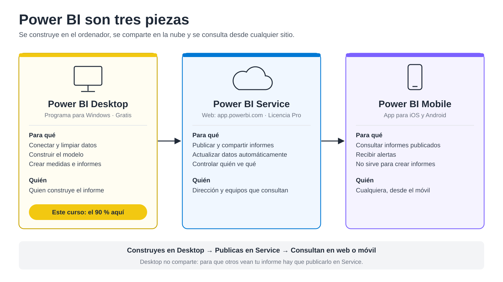
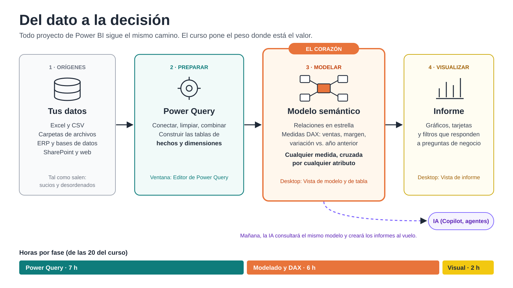
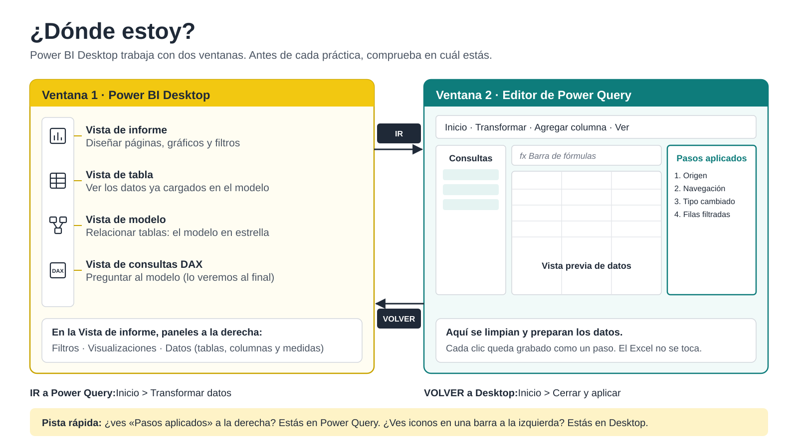

# 1. Primeros pasos con Power BI

**En este capítulo:** qué es Power BI, qué camino siguen los datos hasta convertirse en un informe, cómo moverte entre las ventanas del programa y tu primer informe completo, de un Excel a un gráfico.

---

## 1.1 Prepara tu equipo

Todos los archivos del curso están en este repositorio. Descárgalos una sola vez:

1. En la página principal del repositorio, pulsa el botón verde **Code > Download ZIP**.
2. Haz clic derecho sobre `Curso-Power-BI-Basico-main.zip` > **Extraer todo**.
3. Borra la ruta que propone Windows, escribe solo **`C:\`** y pulsa **Extraer**.

Comprueba que tienes la carpeta `C:\Curso-Power-BI-Basico-main\` y que dentro están directamente las carpetas de ejercicios. Usar todos la misma ruta permite abrir los archivos de ejemplo del curso sin tener que reconfigurar nada.

---

## 1.2 Hacia dónde vamos

Al final del curso serás capaz de construir un informe como el de la carpeta `Proyecto Modelo de Ventas`: un cuadro de mando de ventas en el que puedes filtrar por cliente, producto o periodo, comparar con el año anterior y con el presupuesto, y entrar al detalle de cualquier cliente con un clic.

Mientras lo exploras, piensa:
- ¿Qué preguntas de negocio responde este informe?
- ¿Cuánto tardarías en responderlas hoy con Excel?
- ¿Qué pasará con este informe cuando entren las ventas de mañana? Se actualiza solo, sin rehacer nada.

Lo más importante de ese informe no es lo que se ve, sino lo que hay debajo: unos datos bien preparados y bien relacionados. En eso se centra el curso.

---

## 1.3 Qué es Power BI

Power BI no es un único programa, sino tres piezas que trabajan juntas:

- **Power BI Desktop** es donde se construye todo: conectar los datos, limpiarlos, crear el modelo y diseñar el informe. Es gratuito, funciona en Windows y es donde pasarás casi todo el curso.
- **Power BI Service** (app.powerbi.com) es la plataforma en la nube donde se publican los informes para que otras personas los vean y donde se programa su actualización automática. Para compartir hace falta licencia Pro.
- **Power BI Mobile** es la aplicación para iOS y Android con la que se consultan los informes publicados desde el móvil.

**Idea clave:** Desktop no comparte. Enviar un archivo .pbix por correo no es la forma de distribuir un informe; el informe se publica en Service y desde ahí lo consulta quien tenga permiso.

---

## 1.4 Del dato a la decisión

Todo proyecto de Power BI, sea del tamaño que sea, recorre las mismas cuatro fases:

1. **Orígenes.** Los datos están donde están: Excel, CSV, el ERP, SharePoint, una web. Casi nunca vienen preparados para analizar.
2. **Preparar, con Power Query.** Conectas, limpias y transformas. Aquí construyes las tablas que el modelo necesita: tablas de **hechos** (lo que ocurre: ventas, albaranes, asientos) y tablas de **dimensiones** (lo que lo describe: clientes, productos, fechas).
3. **Modelar.** Relacionas esas tablas en forma de estrella y creas medidas: ventas, margen, variación frente al año anterior. Es el corazón de Power BI, porque un buen modelo permite cruzar cualquier medida por cualquier atributo.
4. **Visualizar.** Diseñas el informe que responde a las preguntas de negocio.

**Por qué el curso dedica más tiempo a preparar y modelar:** es lo que aporta valor y lo que más cuesta aprender. Cada vez más, la inteligencia artificial consultará directamente el modelo y generará informes al vuelo. Un buen modelo seguirá siendo imprescindible; el gráfico, cada vez menos.

---

## 1.5 ¿Dónde estoy?

Power BI Desktop trabaja con dos ventanas distintas. Saber en cuál estás en cada momento es la mitad del camino.

### Ventana 1: Power BI Desktop

En la barra de la izquierda tienes las vistas:

- **Vista de informe:** donde diseñas las páginas con gráficos y filtros. A la derecha encontrarás los paneles **Filtros**, **Visualizaciones** y **Datos**.
- **Vista de tabla:** muestra los datos ya cargados en el modelo. Sirve para comprobar, no para transformar.
- **Vista de modelo:** muestra las tablas y sus relaciones. Aquí construirás el modelo en estrella.
- **Vista de consultas DAX:** permite hacer preguntas al modelo escribiendo código. La verás al final del curso.

### Ventana 2: Editor de Power Query

Se abre aparte y tiene otro aspecto:

- Arriba, sus propias pestañas: **Inicio**, **Transformación**, **Agregar columna** y **Ver**.
- A la izquierda, el panel **Consultas**, con una consulta por cada tabla.
- En el centro, la **barra de fórmulas** y la **vista previa de datos**.
- A la derecha, **Configuración de la consulta**, con los **Pasos aplicados**. Cada transformación que haces queda grabada como un paso que puedes revisar, cambiar o borrar. El archivo original nunca se modifica.

### Cómo pasar de una a otra

- Para **ir** a Power Query: en Desktop, **Inicio > Transformar datos**.
- Para **volver** a Desktop aplicando los cambios: en Power Query, **Inicio > Cerrar y aplicar**.

> **Pista rápida:** si ves «Pasos aplicados» a la derecha, estás en Power Query. Si ves una barra de iconos a la izquierda, estás en Desktop.

### Práctica: la búsqueda del tesoro

Abre el informe de `Proyecto Modelo de Ventas` y sigue estos pasos en orden:

1. Ve a la **Vista de modelo**. ¿Cuántas tablas hay?
2. Ve a la **Vista de tabla** y abre la tabla de clientes. ¿Cuántas filas tiene? Lo verás abajo a la izquierda.
3. Vuelve a la **Vista de informe**. En el panel **Datos**, localiza una medida (tiene el icono de una calculadora).
4. Abre el **Editor de Power Query** con **Inicio > Transformar datos**.
5. Selecciona una consulta en el panel **Consultas** y haz clic en el primer paso de **Pasos aplicados**. ¿Qué ves? Ahora haz clic en el último.
6. Cierra el Editor de Power Query con la X, sin haber cambiado nada, y elige no aplicar los cambios.

---

## 1.6 Tu primer informe completo

**Archivo:** `C:\Curso-Power-BI-Basico-main\Ejercicio Modelado\Ventas_Planas.xlsx`, con 500 líneas de venta en una única tabla.

**Objetivo:** recorrer una vez todo el camino, sin entrar en detalle. El resto del curso profundiza en cada fase.

| Paso | Fase | Dónde | Qué haces |
|---|---|---|---|
| 1 | Orígenes | Desktop | **Inicio > Obtener datos > Libro de Excel**, elige el archivo, marca la hoja **Ventas** y pulsa **Transformar datos** |
| 2 | Preparar | Power Query | Revisa el tipo de dato de cada columna (el icono a la izquierda del nombre) y observa cómo se añaden pasos |
| 3 | Preparar | Power Query | Quita la columna `MargenPct`: un porcentaje no se puede sumar, se calcula con una medida |
| 4 | Preparar | Power Query | **Inicio > Cerrar y aplicar** |
| 5 | Modelar | Desktop, Vista de tabla | Comprueba que los datos han llegado |
| 6 | Modelar | Desktop, Vista de informe | **Inicio > Nueva medida**: `Ventas = SUM(Ventas[Importe])` |
| 7 | Visualizar | Desktop, Vista de informe | Crea un gráfico de columnas con **Ventas** por **Familia** |
| 8 | Visualizar | Desktop, Vista de informe | Añade una segmentación por **Provincia** y prueba a filtrar |

**Para pensar:** vuelve a la Vista de tabla. ¿Cuántas veces aparece escrito el nombre de cada cliente? ¿Y la familia de cada producto? Esta tabla funciona con 500 filas, pero no con 5 millones, ni cuando necesites cruzarla con otra tabla como el presupuesto. Cómo resolverlo es el tema del capítulo de modelado.

---

## 1.7 Repaso: ¿dónde se hace?

| Acción | Dónde |
|---|---|
| Quitar una columna que no sirve | Editor de Power Query |
| Ver cuántas filas se han cargado | Desktop, Vista de tabla |
| Relacionar Clientes con Ventas | Desktop, Vista de modelo |
| Crear un gráfico | Desktop, Vista de informe |
| Corregir un tipo de dato | Editor de Power Query |
| Deshacer una transformación | Editor de Power Query, Pasos aplicados |

**Lo que te llevas de este capítulo:** el mapa del curso (las cuatro fases), las dos ventanas de Power BI y cómo pasar de una a otra, y tu primer informe hecho de principio a fin.
