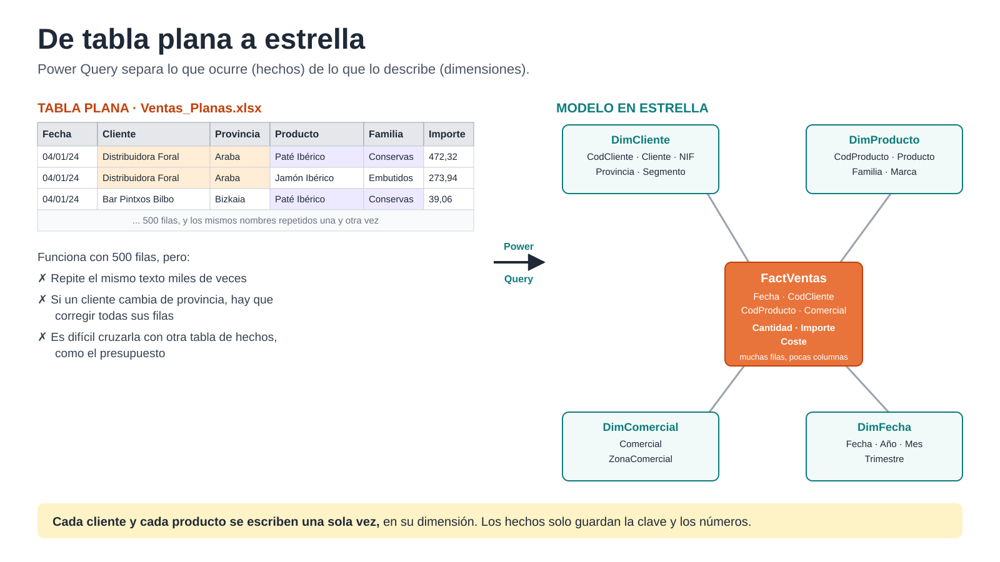
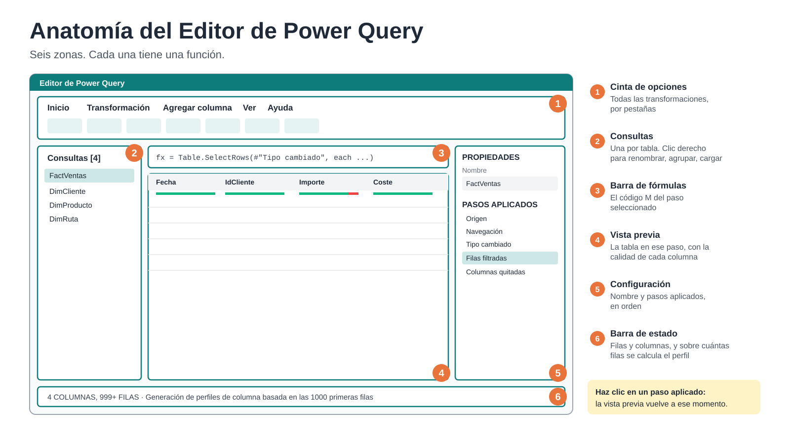
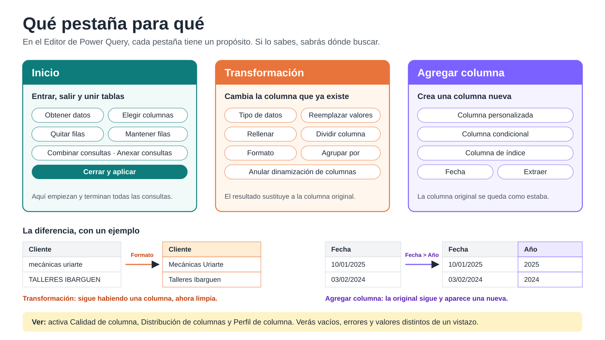
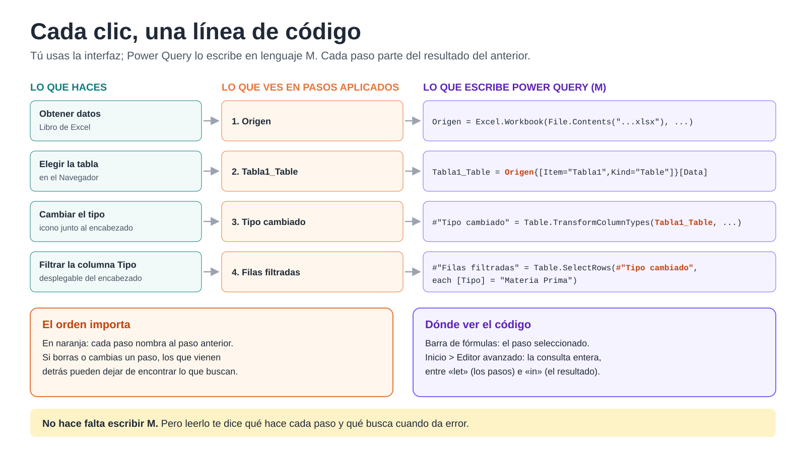
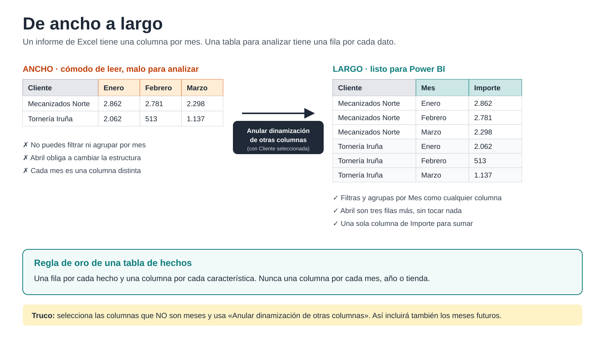
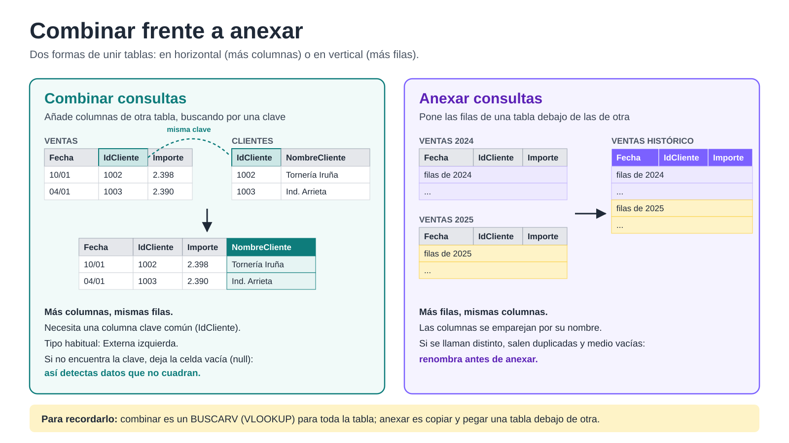

# 2. Power Query: preparar los datos

**En este capítulo:** para qué preparamos los datos, cómo se organiza el Editor de Power Query, cómo conectar con los orígenes más habituales, las transformaciones que más vas a usar y, al final, un proyecto en el que construyes las tablas de hechos y dimensiones de un modelo de ventas real.

**Carpeta de trabajo:** `C:\Curso-Power-BI-Basico-main\Ejercicios Power Query\`. Cada archivo de ejercicio incluye una hoja `LEER_PRIMERO` con el enunciado.

---

## 2.1 Para qué preparamos los datos



En el capítulo anterior cargaste `Ventas_Planas.xlsx`: una única tabla en la que cada fila es una línea de venta y en la que el nombre del cliente, su provincia, el producto o la familia se repiten una y otra vez.

Esa tabla mezcla dos tipos de información:

- **Lo que ocurre:** cada venta, con su fecha, su cantidad y su importe. Son los **hechos**. Hay muchas filas y crecen cada día.
- **Lo que lo describe:** quién es el cliente, qué producto es, a qué familia pertenece, quién es el comercial. Son las **dimensiones**. Hay pocas filas y cambian poco.

Power BI funciona mejor cuando los separas: una **tabla de hechos** en el centro, rodeada de **tablas de dimensiones**, cada una con una clave que la une a los hechos. Es el **modelo en estrella**, y lo construirás en el capítulo 3.

**Lo importante ahora:** Power Query es la herramienta con la que fabricas esas tablas. Cada transformación de este capítulo tiene ese objetivo final: dejar tablas de hechos y dimensiones limpias y listas para relacionar.

---

## 2.2 El Editor de Power Query por dentro

### Las áreas de la pantalla



1. **Cinta de opciones.** Las pestañas **Inicio**, **Transformación**, **Agregar columna**, **Ver** y **Ayuda**, con todas las transformaciones.
2. **Panel Consultas**, a la izquierda. Una consulta por cada tabla que preparas. Desde aquí las renombras, las agrupas en carpetas, las duplicas o decides si se cargan al modelo (clic derecho sobre cada una).
3. **Barra de fórmulas.** Muestra el código del paso seleccionado. Si no la ves, actívala en **Ver > Barra de fórmulas**.
4. **Vista previa de datos.** Cómo queda la tabla en el paso seleccionado. Es una vista previa: no muestra necesariamente todas las filas.
5. **Configuración de la consulta**, a la derecha. Arriba, en **Propiedades**, el nombre de la consulta. Debajo, los **Pasos aplicados**.
6. **Barra de estado**, abajo. Cuántas columnas y filas tiene la vista previa y sobre cuántas filas se calcula el perfil de columnas.

### Qué pestaña para qué



Las pestañas no están ordenadas al azar. Si sabes qué hace cada una, sabrás dónde buscar:

- **Inicio:** conectar orígenes, elegir y quitar columnas o filas, combinar y anexar consultas, y **Cerrar y aplicar**.
- **Transformación:** modifica columnas que **ya existen**. Si cambias el tipo de dato, rellenas hacia abajo o divides una columna, el resultado sustituye a la columna original.
- **Agregar columna:** crea columnas **nuevas** y deja la original intacta. Muchas opciones están repetidas en Transformación y en Agregar columna; la diferencia es esa.
- **Ver:** opciones de visualización: barra de fórmulas, perfil de columnas, **Editor avanzado** y las vistas de diagrama y de esquema.

### Los pasos aplicados: el orden importa

Cada clic que das en la interfaz se graba como un **paso** en la lista **Pasos aplicados**. Los pasos funcionan como una receta: cada uno parte del resultado del anterior.

- **Haz clic en cualquier paso** para ver cómo estaba la tabla en ese momento. Es la mejor forma de entender qué ha hecho cada uno.
- **El icono del engranaje** que aparece junto a algunos pasos abre de nuevo su ventana de configuración para modificarlo.
- **Para eliminar un paso**, pulsa la X que aparece a su izquierda. Ojo: si un paso posterior dependía de él, ese paso fallará.
- **Si seleccionas un paso intermedio y haces una transformación**, Power Query te avisará de que vas a **insertar un paso** en medio. Los pasos siguientes se aplicarán sobre el nuevo resultado y pueden dejar de funcionar.
- **Renombra los pasos importantes** (clic derecho > **Cambiar nombre**) para que la lista se lea como una explicación de lo que has hecho.

**Por qué importa el orden:** no es lo mismo filtrar y después agrupar que agrupar y después filtrar. Y si en el paso 3 renombras la columna `Cliente` como `NombreCliente`, todos los pasos posteriores la buscarán con el nombre nuevo. Si luego borras el paso 3, esos pasos buscarán una columna que ya no existe.

### Detrás de cada clic, código M



Power Query traduce cada acción de la interfaz a una línea de un lenguaje llamado **M**. No necesitas escribirlo, pero saber leerlo te ayuda a entender qué está pasando:

- La **barra de fórmulas** muestra el código del paso seleccionado.
- **Inicio > Editor avanzado** (o **Ver > Editor avanzado**) muestra la consulta completa: todos los pasos, uno debajo de otro.

Una consulta tiene siempre esta forma:

```
let
    Origen = Excel.Workbook(File.Contents("C:\Curso-Power-BI-Basico-main\...\PowerQuery_Ej_1_0.xlsx"), null, true),
    Tabla1_Table = Origen{[Item="Tabla1",Kind="Table"]}[Data],
    #"Tipo cambiado" = Table.TransformColumnTypes(Tabla1_Table, {{"IdProveedor", Int64.Type}, {"NombreProveedor", type text}, {"Tipo", type text}}),
    #"Filas filtradas" = Table.SelectRows(#"Tipo cambiado", each [Tipo] = "Materia Prima")
in
    #"Filas filtradas"
```

- Entre `let` e `in` están los pasos, con el mismo nombre que ves en **Pasos aplicados**.
- Cada paso usa el resultado del anterior: `#"Filas filtradas"` parte de `#"Tipo cambiado"`, que parte de `Tabla1_Table`. Por eso el orden importa.
- Después de `in` va el paso cuyo resultado se carga, normalmente el último.

> En este curso no escribiremos código M: todo se hace con la interfaz. Pero cuando algo falle, la barra de fórmulas te dirá qué columna o qué valor está buscando el paso que da error.

### Calidad, distribución y perfil de columnas

En la pestaña **Ver** activa estas tres opciones y déjalas activadas durante todo el curso:

| Opción | Qué muestra bajo cada encabezado | Para qué te sirve |
|---|---|---|
| **Calidad de columna** | Porcentaje de valores **válidos**, con **error** y **vacíos** | Detectar de un vistazo nulos y errores, por ejemplo tras cambiar un tipo de dato |
| **Distribución de columnas** | Número de valores **distintos** y **únicos**, con un pequeño gráfico | Comprobar si una columna puede ser clave: en una buena clave, cada valor aparece una sola vez |
| **Perfil de columna** | Estadísticas (mínimo, máximo, media, vacíos...) y la distribución de valores de la columna seleccionada | Revisar una columna a fondo antes de usarla |

Si haces clic sobre la barra de errores o de vacíos, Power Query te ofrece **Mantener errores**, **Quitar errores** o **Reemplazar errores**, entre otras opciones.

> **Atención:** por defecto el perfil se calcula solo sobre las **primeras 1.000 filas**. Para analizar la tabla completa, haz clic en el texto de la barra de estado que lo indica y cambia a **toda la base de datos** (o el conjunto de datos completo).

### Vista de diagrama y vista de esquema

Además de la vista de datos habitual, el Editor ofrece dos vistas más desde la pestaña **Ver**:

- **Vista de diagrama:** muestra cada consulta como una caja y las flechas que las conectan. Ves de un vistazo qué consulta parte de cuál (referencias), qué consultas se combinan o se anexan, y qué pasos tiene cada una. Es muy útil cuando el proyecto crece.
- **Vista de esquema:** muestra la lista de columnas de la consulta con su tipo de dato, sin los datos. Permite reordenar, renombrar, quitar columnas o cambiar tipos de forma rápida cuando una tabla tiene muchas columnas.

### Ejercicio 2.2.a · Conectar a una hoja o a una tabla, y ver el código

**Archivo:** `PQ bloque 1\PowerQuery_Ej_1_0.xlsx`

1. **Inicio > Obtener datos > Libro de Excel** y elige el archivo.
2. En el Navegador verás hojas (icono de hoja) y tablas (icono de tabla). Marca la hoja **Clientes2025** y pulsa **Transformar datos**.
3. Observa el resultado: aparecen filas vacías y la fila de título, y los encabezados no están en su sitio. Una hoja trae **todo** lo que hay en ella.
4. Vuelve a conectar, ahora marcando la tabla **Tabla1** (la de proveedores). Sus encabezados y límites vienen ya definidos.
5. En `Tabla1`, filtra la columna `Tipo` para quedarte con `Materia Prima`.
6. Haz clic en cada paso de **Pasos aplicados** y mira cómo cambian la vista previa y la barra de fórmulas.
7. Abre el **Editor avanzado** y localiza la línea de cada paso.

**Conclusión:** siempre que puedas, conecta a **tablas** de Excel, no a hojas. Si el archivo lo genera otra persona, pídele que lo entregue como tabla (en Excel, **Insertar > Tabla**).

### Ejercicio 2.2.b · El orden de los pasos

Con la consulta `Tabla1` del ejercicio anterior:

1. Renombra la columna `NombreProveedor` como `Proveedor`.
2. Ordena la tabla por `Proveedor`, de la A a la Z. Ya tienes dos pasos nuevos: **Columnas con nombre cambiado** y **Filas ordenadas**.
3. Haz clic en el paso **Filas filtradas** (anterior a los dos nuevos) y quita la columna `IdProveedor`. Power Query te avisa de que vas a **insertar un paso** en medio: acepta. Los pasos siguientes siguen funcionando, porque no usan esa columna.
4. Ahora elimina el paso **Columnas con nombre cambiado** con la X. Haz clic en el último paso: da error, porque busca la columna `Proveedor`, que ya no existe.
5. Lee el mensaje de error y la barra de fórmulas: te dicen exactamente qué columna falta. Deshaz el borrado con **Ctrl + Z** o vuelve a crear el paso.

**Conclusión:** cada paso depende de los anteriores. Antes de borrar o insertar un paso en medio, piensa qué pasos vienen detrás.

### Ejercicio 2.2.c · Duplicar o hacer referencia

1. Clic derecho sobre `Tabla1` en el panel **Consultas** > **Duplicar**. Renómbrala `Copia`.
2. Clic derecho sobre `Tabla1` > **Referencia**. Renómbrala `Referencia`.
3. Quita una columna en `Tabla1` y observa qué pasa en cada una.
4. Activa **Ver > Vista de diagrama**: verás la flecha que une `Tabla1` con `Referencia`, y que `Copia` es independiente.

**Conclusión:** **Duplicar** crea una copia independiente con todos sus pasos. **Referencia** crea una consulta que parte del resultado de la original y hereda sus cambios. La usarás mucho: una consulta base y varias referencias que construyen tablas distintas a partir de ella.

### Ejercicio 2.2.d · Detectar errores con la calidad de columna

**Archivo:** `PQ bloque 1\PowerQuery_Ej_1_3_QuitarMantenerFilas.xlsx`, hoja `TABLA_SUCIOS`.

1. Con **Calidad de columna** activada, cambia la columna `Cantidad` a **Número entero**.
2. Fíjate en la franja roja de errores bajo el encabezado: hay valores que no son números.
3. Haz clic en la franja > **Mantener errores** para ver qué filas son. Después elimina ese paso.
4. Selecciona la columna `Producto` y mira su **Perfil de columna**: verás valores que no son productos (encabezados repetidos, totales). Los limpiarás en el ejercicio 2.4.c.

---

## 2.3 Conectar con los orígenes

Power BI se conecta a cientos de orígenes, pero en una empresa casi siempre aparecen los mismos:

| Origen | Cuándo lo vas a usar | Dónde está |
|---|---|---|
| **Libro de Excel** | Listados, exportaciones, presupuestos | **Obtener datos > Libro de Excel** |
| **Texto/CSV** | Exportaciones de ERP y de bancos | **Obtener datos > Texto/CSV** |
| **Carpeta** | Un archivo por mes, por tienda o por delegación con la misma estructura | **Obtener datos > Más... > Carpeta** |
| **SharePoint** | Archivos compartidos del equipo | **Obtener datos > Más... > Carpeta de SharePoint** |
| **Base de datos** | El ERP o el programa de gestión | **Obtener datos > SQL Server**, entre otros |
| **Web** | Tablas publicadas en una página | **Obtener datos > Web** |

### Ejercicio 2.3.a · Combinar todos los archivos de una carpeta

**Carpeta:** `PQ Carpeta\Ventas_2024\`, con un CSV de ventas por cada mes de 2024.

1. **Inicio > Obtener datos > Más... > Carpeta** y selecciona la carpeta `Ventas_2024`.
2. Verás la lista de archivos. Pulsa **Combinar > Combinar y transformar datos**.
3. En la ventana **Combinar archivos**, Power Query usa el primer archivo como ejemplo para entender la estructura. Pulsa **Aceptar**.
4. Resultado: una sola consulta con las ventas de los 12 meses. La columna `Source.Name` indica de qué archivo viene cada fila.
5. Revisa los tipos de dato de `FechaVenta`, `PrecioUnitario` e `Importe`.

**Por qué es tan útil:** el mes que viene basta con dejar el archivo de enero de 2025 en la carpeta y pulsar **Actualizar**. No hay que tocar nada más.

> En el panel **Consultas** aparecerán consultas auxiliares que Power Query crea para combinar (archivo de ejemplo, función de transformación). No las borres.

### Ejercicio 2.3.b · Leer una tabla de una página web

1. **Inicio > Obtener datos > Web** y pega la dirección de la página del Índice de Precios de Consumo en la sección de prensa del INE (ine.es).
2. En el Navegador, elige la tabla que contiene la serie mensual y pulsa **Transformar datos**.
3. Limpia lo necesario: encabezados, filas de notas y tipos de dato.

> El conector **Web** está pensado para leer **tablas de páginas web**. Para descargar un archivo Excel o CSV publicado en internet hace falta otro método, que no veremos en este curso.

---

## 2.4 Limpiar: las transformaciones que más vas a usar

Todas están en las pestañas **Inicio** y **Transformación**. Cada ejercicio usa un archivo de `PQ bloque 1\`.

### Ejercicio 2.4.a · Tipos de datos

**Archivo:** `PowerQuery_Ej_1_1.xlsx`, hoja `TABLA_1_1_CONSISTENTE`.

Todas las columnas llegan como texto: fechas, horas, importes con formato europeo y anglosajón, porcentajes, booleanos.

1. Cambia el tipo de cada columna con el icono que hay a la izquierda de su nombre.
2. Fíjate en los importes con formato anglosajón (`1,234.50`): con el tipo **Número decimal** normal dan error o un valor equivocado. Para ellos, clic derecho en el encabezado > **Cambiar tipo > Usar configuración regional...** e indica **Inglés (Estados Unidos)**.
3. En las columnas con símbolos (`€`, paréntesis, espacio de miles), usa primero **Transformación > Reemplazar valores** y después cambia el tipo.

**Por qué importa:** el tipo de dato decide qué puedes hacer después. Un importe guardado como texto no se puede sumar, y una fecha como texto no sirve para analizar por meses.

### Ejercicio 2.4.b · Rellenar hacia abajo

**Archivo:** `PowerQuery_Ej_1_2_FillDown.xlsx`, hoja `ASIENTOS_FILLDOWN`.

En este libro diario solo la primera línea de cada asiento tiene fecha.

1. Selecciona la columna `Fecha`.
2. **Transformación > Rellenar > Hacia abajo**.

Cada línea hereda la fecha de la línea anterior que sí la tiene. Es muy habitual en exportaciones de contabilidad y de ERP.

### Ejercicio 2.4.c · Quitar y mantener filas

**Archivo:** `PowerQuery_Ej_1_3_QuitarMantenerFilas.xlsx`, hoja `TABLA_SUCIOS`.

La tabla trae filas de título, encabezados repetidos en medio, filas de `TOTAL LÍNEA`, duplicados y alguna cantidad no numérica.

1. **Inicio > Quitar filas > Quitar filas superiores** para eliminar las filas de título, y después **Transformación > Usar la primera fila como encabezado**.
2. Filtra la columna `Producto` para quitar los encabezados repetidos y las filas de `TOTAL LÍNEA`.
3. Cambia `Cantidad` a **Número entero** y usa **Inicio > Quitar filas > Quitar errores**.
4. **Inicio > Quitar filas > Quitar duplicados**.
5. Con la hoja `MANTENER_PRIMERAS_10`, prueba **Inicio > Mantener filas > Mantener filas superiores**.

**Idea clave:** antes de analizar, la tabla tiene que contener solo datos. Ni títulos, ni totales, ni filas en blanco.

### Ejercicio 2.4.d · Dividir una columna

**Archivo:** `PowerQuery_Ej_1_4_Dividir_Direccion.xlsx`

1. Selecciona `Dirección completa` > **Transformación > Dividir columna > Por delimitador**, con la coma como delimitador. Obtienes calle, ciudad y provincia.
2. Repite sobre la columna de la calle usando **Espacio** como delimitador y la opción **Delimitador situado más a la derecha** para separar el número.
3. Renombra las columnas resultantes.

### Ejercicio 2.4.e · Normalizar texto

**Archivo:** `PowerQuery_Ej_1_5_Extraer_Limpiar_Texto.xlsx`

1. Columna `Cliente`: **Transformación > Formato > Recortar** y **Limpiar** para quitar espacios sobrantes; después **Poner En Mayúsculas Cada Palabra**.
2. Columna `Producto`: **Agregar columna > Extraer > Texto entre delimitadores**, con `[` y `]`, para obtener la referencia.

**Archivo:** `PowerQuery_Ej_1_10_Estado_ReemplazarFiltrar.xlsx`

3. La columna `Estado` tiene el mismo valor escrito de muchas formas (`Paid`, `PAID `, ` pagado `, `PAG`, `P`...). Recorta, unifica mayúsculas y usa **Transformación > Reemplazar valores** hasta dejar un único término por estado.
4. Filtra para ver solo las facturas pagadas.

**Por qué importa:** para Power BI, `Mecánicas Uriarte` y `mecánicas uriarte ` son dos clientes distintos. Una gran parte de la limpieza es estandarizar texto.

### Ejercicio 2.4.f · De ancho a largo: anular dinamización



**Archivo:** `PowerQuery_Ej_1_7_Despivotar.xlsx`

La tabla tiene una columna por mes, como un informe de Excel. Es cómoda de leer, pero no sirve para analizar: no puedes filtrar por mes ni añadir abril sin cambiar la estructura.

1. Selecciona la columna `Cliente`.
2. **Transformación > Anular dinamización de otras columnas**.
3. Renombra las columnas resultantes como `Mes` e `Importe`.

**Idea clave:** una tabla de hechos tiene **una fila por cada hecho**, no una columna por cada mes. Usa **Anular dinamización de otras columnas** en lugar de seleccionar los meses: así, si mañana llega abril, también se incluirá.

### Ejercicio 2.4.g · Quitar duplicados para crear una dimensión

**Archivo:** `PowerQuery_Ej_1_9_Ordenar_Duplicados.xlsx`

El listado de clientes viene de varias fuentes y cada cliente aparece varias veces.

1. Comprueba que `NIF` es de tipo texto.
2. Ordena por `NombreCliente`.
3. Selecciona la columna `NIF` > **Inicio > Quitar filas > Quitar duplicados**.

Deben quedar 12 clientes únicos. Acabas de construir una **dimensión**: una fila por cliente, con una clave que no se repite.

### Ejercicio 2.4.h · Agrupar por, como paso intermedio

**Archivo:** `PowerQuery_Ej_1_8_AgruparPor.xlsx`

**Agrupar por** resume una tabla: una fila por cada valor de la columna que elijas, con una suma, un recuento, un máximo... En Power BI no se usa para cargar la tabla de hechos ya resumida (eso lo harán las medidas, con todo el detalle disponible), sino como **paso intermedio** para preparar o comprobar datos. Algunos usos habituales:

- Contar cuántas veces aparece cada clave para detectar duplicados antes de relacionar tablas.
- Obtener la última fecha o el último precio de cada producto o cliente.
- Construir una dimensión a partir de una tabla plana: una fila por cliente.

1. Haz clic derecho sobre la consulta > **Referencia**, para no modificar la original.
2. En la referencia, **Transformación > Agrupar por**: agrupa por `Cliente` con la operación **Recuento de filas** y llámala `NumVentas`.
3. Elige **Avanzado** para añadir una segunda agregación: **Máximo** de `Fecha`, llamada `UltimaVenta`.
4. Resultado: cuántas ventas tiene cada cliente y cuándo fue la última. La consulta original sigue teniendo todas sus filas.

---

## 2.5 Crear columnas nuevas

Todas están en la pestaña **Agregar columna**. Archivo: `PQ bloque 2\PowerQuery_Bloque2_AgregarColumna.xlsx`.

### Ejercicio 2.5.a · Columna personalizada

Hoja `2_2_PERSONALIZADA`.

1. **Agregar columna > Columna personalizada**.
2. Nombre: `Importe`. Fórmula: haz doble clic en `Cantidad` en la lista de la derecha, escribe `*` y haz doble clic en `PrecioUnitario`. Queda `[Cantidad] * [PrecioUnitario]`.
3. Cambia el tipo de la nueva columna a **Número decimal**.

### Ejercicio 2.5.b · Columna condicional

Hoja `2_3_CONDICIONAL`. Queremos marcar como `Riesgo` las facturas no pagadas de más de 1.000 €.

1. **Agregar columna > Columna condicional**. Nombre: `Situación`.
2. Primera regla: si `Pagado (Sí/No)` es igual a `Sí`, entonces `OK`.
3. **Agregar cláusula**: si `ImporteFactura` es mayor que `1000`, entonces `Riesgo`.
4. En caso contrario: `OK`.

Las reglas se evalúan en orden: a la segunda solo llegan las facturas no pagadas. Es la forma de combinar dos condiciones sin escribir código.

### Ejercicio 2.5.c · Columnas a partir de una fecha

Hoja `2_4_FECHAS`.

1. Selecciona `FechaFactura` > **Agregar columna > Fecha > Año > Año**.
2. De nuevo > **Fecha > Mes > Nombre del mes**.
3. De nuevo > **Fecha > Mes > Fin del mes**.

Son útiles para agrupar o comprobar datos en Power Query. Para analizar por fechas en el informe usaremos una tabla calendario, en el capítulo 3.

### Ejercicio 2.5.d · Columna de índice

Hoja `2_6_INDICE`.

1. **Agregar columna > Columna de índice > Desde 1**.

La columna de índice numera las filas. Sirve para:

- **Crear una clave** cuando la tabla no tiene una columna que identifique cada fila de forma única. Es lo que se llama una **clave subrogada**, y la usarás en el proyecto de este capítulo.
- **Conservar el orden original** de los datos, por ejemplo el orden de los movimientos de un extracto bancario dentro del mismo día.

---

## 2.6 Combinar y anexar consultas



Archivo: `PQ bloque 3\PowerQuery_Bloque3_Combinar_Anexar.xlsx`.

- **Combinar consultas** une dos tablas **en horizontal**: añade columnas de otra tabla buscando las filas que coinciden por una columna clave. Es el equivalente a un BUSCARV (VLOOKUP), pero para toda la tabla a la vez.
- **Anexar consultas** une tablas **en vertical**: pone las filas de una debajo de las de otra. Las columnas tienen que llamarse igual.

### Ejercicio 2.6.a · Combinar ventas con clientes

1. Carga las hojas `VENTAS` y `CLIENTES`.
2. Selecciona `VENTAS` > **Inicio > Combinar consultas > Combinar consultas como nuevas**.
3. Tabla de abajo: `CLIENTES`. Haz clic en la columna `IdCliente` de cada tabla.
4. Tipo de combinación: **Externa izquierda** (todas las filas de la primera tabla y las coincidentes de la segunda).
5. En la nueva columna, pulsa el icono de expandir y marca solo `NombreCliente` y `Provincia`. Desmarca **Usar el nombre de columna original como prefijo** para que las columnas no se llamen `CLIENTES.NombreCliente`.

### Ejercicio 2.6.b · Detectar ventas sin cliente

Fíjate en la combinación anterior: algunas filas tienen `NombreCliente` vacío (`null`). Son ventas de un `IdCliente` que no existe en la tabla de clientes.

1. Filtra `NombreCliente` para ver solo los valores `null`.
2. Esas son las ventas que, en un informe, aparecerían en «(En blanco)».

**Idea clave:** Power Query también sirve para **controlar la calidad** de los datos. Detectar estos casos antes de cargar evita cifras que no cuadran después.

### Ejercicio 2.6.c · Anexar dos años de ventas

1. Carga las hojas `VENTAS2024` y `VENTAS2025`.
2. Antes de anexar, compara las columnas de ambas: la de importe no se llama igual en las dos. Renombra ambas como `Importe`.
3. Selecciona `VENTAS2024` > **Inicio > Anexar consultas > Anexar consultas como nuevas** y elige `VENTAS2025`.
4. Renombra la nueva consulta como `Ventas_Historico`.

> Prueba a anexar **sin** renombrar antes: obtendrás dos columnas de importe a medio rellenar. Al anexar, Power Query empareja las columnas por su nombre.

5. Opcional: combina `Ventas_Historico` con `CLIENTES` y detecta las ventas sin cliente, como en el ejercicio 2.6.b.

---

## 2.7 Proyecto: prepara el modelo de ventas

**Archivo:** `C:\Curso-Power-BI-Basico-main\Proyecto Modelo de Ventas\BD_Ventas.xlsx`

Este archivo tiene la estructura de una exportación de un programa de gestión de una distribuidora de bebidas: albaranes de 2024 y 2025, sus líneas, clientes, productos, familias, rutas, provincias y países. Como en cualquier ERP, las tablas tienen decenas o cientos de columnas, de las que solo necesitas unas pocas.

**Objetivo:** construir con Power Query las tablas que necesitará el modelo en estrella del capítulo 3.

| Tabla final | Tipo | Se construye a partir de |
|---|---|---|
| `FactVentas` | Hechos | `lineaAlbaran` + datos de cabecera de `albaran` |
| `DimCliente` | Dimensión | `Cliente` + `provincia` + `pais` |
| `DimProducto` | Dimensión | `Producto` + `familia` |
| `DimRuta` | Dimensión | `Rutas` |

### Paso 1 · Conectar

1. **Obtener datos > Libro de Excel** > `BD_Ventas.xlsx`.
2. En el Navegador, marca las **tablas** (no las hojas): `lineaAlbaran`, `albaran`, `Cliente`, `Producto`, `familia`, `Rutas`, `provincia` y `pais`. Pulsa **Transformar datos**.

### Paso 2 · Organizar las consultas

1. En el panel **Consultas**, selecciona las ocho y haz clic derecho > **Mover al grupo > Nuevo grupo**: `1. Origen`.
2. Crea también los grupos `2. Dimensiones` y `3. Hechos`.

Las consultas de origen no se cargarán al modelo; las de los grupos 2 y 3, sí.

### Paso 3 · DimProducto

1. Clic derecho sobre `Producto` > **Referencia**. Renombra la nueva consulta `DimProducto` y muévela al grupo `2. Dimensiones`.
2. **Inicio > Elegir columnas**: quédate con `referencia`, `descrip` e `idfamilia`. Producto tiene 470 columnas: elegir las que necesitas es el primer paso de casi cualquier consulta.
3. **Inicio > Combinar consultas** con `familia`, por `idfamilia`, tipo **Externa izquierda**. Expande solo `descrip` y renómbrala `Familia`.
4. Dos productos tienen `idfamilia` = 0 y no encuentran familia. Selecciona `Familia` > **Transformación > Reemplazar valores**: sustituye `null` por `Sin familia`.
5. Renombra en lenguaje de negocio: `referencia` → `CodProducto`, `descrip` → `Producto`. Quita `idfamilia`.

> Acabas de **aplanar** dos tablas en una. En el modelo no habrá una tabla de familias aparte: la familia es un atributo más del producto.

### Paso 4 · DimCliente

1. Referencia de `Cliente` > renómbrala `DimCliente` y muévela al grupo `2. Dimensiones`.
2. **Elegir columnas:** `idCliente`, `nomCom`, `ciudad`, `idProvincia`, `idPais`.
3. Combina con `provincia` (`idProvincia` con `id`) y expande `provincia`.
4. Combina con `pais` (`idPais` con `idpais`) y expande `nombre`, renombrándola `Pais`.
5. Quita las columnas de identificadores que ya no necesitas y renombra: `nomCom` → `Cliente`, `ciudad` → `Ciudad`, `provincia` → `Provincia`.
6. Comprueba que no hay clientes repetidos: haz una **Referencia** de `DimCliente`, **Agrupar por** `idCliente` con **Recuento de filas**, y filtra los recuentos mayores que 1. No debe salir ninguno. Después elimina esta consulta de comprobación.

### Paso 5 · DimRuta

1. Referencia de `Rutas` > `DimRuta`, en el grupo `2. Dimensiones`.
2. Renombra las columnas: `Id Ruta` → `IdRuta`, `Descripción ruta` → `Ruta`.

> Hay 79 albaranes con `idRuta` = 0, que no existe en la tabla de rutas: son ventas sin ruta asignada. Lo resolveremos en el modelo. Detectarlo ahora es parte del trabajo.

### Paso 6 · Clave del albarán

Un albarán no se identifica por un solo campo, sino por dos: la serie (`idSAlb`, por ejemplo `BV25`) y el número (`idAlb`). Vamos a darle una clave única de una sola columna.

1. Referencia de `albaran` > renómbrala `Albaranes` y déjala en `1. Origen`.
2. **Agregar columna > Columna de índice > Desde 1**. Renombra el índice como `IdAlbaran`.

Acabas de crear una **clave subrogada**: un número único por albarán que sustituye a la combinación serie y número.

### Paso 7 · FactVentas

1. Referencia de `lineaAlbaran` > renómbrala `FactVentas` y muévela al grupo `3. Hechos`.
2. **Elegir columnas:** `idSAlb`, `idAlb`, `referencia`, `cantidad`, `precio`, `total` y `totalCoste`.
3. **Inicio > Combinar consultas** con `Albaranes`. Para combinar por dos columnas, haz clic en `idSAlb` y, con la tecla **Ctrl** pulsada, en `idAlb`, en las dos tablas y en el mismo orden. Tipo **Externa izquierda**.
4. Expande `IdAlbaran`, `fechaAlb`, `idCliente` e `idRuta`.
5. Quita `idSAlb` e `idAlb`: ya están representados por `IdAlbaran`.
6. Revisa tipos: `fechaAlb` como **Fecha**; `cantidad` como número; `precio`, `total` y `totalCoste` como **Número decimal**; claves como **Número entero** salvo `referencia`, que es texto.
7. Renombra: `referencia` → `CodProducto`, `fechaAlb` → `Fecha`, `total` → `Importe`, `totalCoste` → `Coste`, `cantidad` → `Cantidad`, `precio` → `Precio`, `idCliente` → `IdCliente`, `idRuta` → `IdRuta`.

> Algunas líneas tienen cantidades e importes negativos: devoluciones y abonos. Son hechos reales y se quedan en la tabla.

### Paso 8 · Decidir qué se carga

1. Selecciona todas las consultas del grupo `1. Origen`, clic derecho y **desmarca Habilitar carga**. Aparecerán en cursiva: Power Query las usa, pero no llegan al modelo.
2. **Inicio > Cerrar y aplicar**.
3. En Desktop, comprueba en la **Vista de tabla** que tienes exactamente cuatro tablas: `FactVentas`, `DimCliente`, `DimProducto` y `DimRuta`.

**Resultado:** una tabla de hechos estrecha y larga (más de 10.000 líneas, pocas columnas, casi todo números y claves) y tres dimensiones cortas y descriptivas. Es la materia prima del capítulo 3.

---

## 2.8 Buenas prácticas

- **Conecta a tablas**, no a hojas, siempre que puedas.
- **Elige columnas y filtra filas lo antes posible.** Cuanto menos traigas, más rápido se actualiza.
- **Pon nombres de negocio** a consultas y columnas: `Cliente`, no `nomCom`.
- **Revisa los tipos de dato** de cada columna antes de cargar.
- **Organiza las consultas en grupos** y **desactiva la carga** de las que son solo pasos intermedios.
- **Renombra los pasos aplicados importantes** (clic derecho > **Cambiar nombre**). Dentro de seis meses agradecerás saber qué hace cada uno.
- **Comprueba la calidad**: claves repetidas, combinaciones sin correspondencia, valores vacíos.

---

## 2.9 Repaso

| Necesito... | Herramienta |
|---|---|
| Que una fecha o un importe se comporten como tal | Tipo de dato (y configuración regional si hace falta) |
| Completar celdas vacías con el valor de arriba | **Transformación > Rellenar > Hacia abajo** |
| Quitar títulos, totales o errores | **Inicio > Quitar filas** |
| Unificar textos escritos de varias formas | **Formato** y **Reemplazar valores** |
| Pasar meses en columnas a filas | **Anular dinamización de otras columnas** |
| Una fila por cliente | **Quitar duplicados** sobre la clave |
| Contar o resumir como paso intermedio | **Agrupar por** sobre una **Referencia** |
| Traer columnas de otra tabla | **Combinar consultas** |
| Poner tablas una debajo de otra | **Anexar consultas** |
| Unir todos los archivos de una carpeta | **Obtener datos > Carpeta** |
| Crear una clave única | **Columna de índice** |

**Lo que te llevas de este capítulo:** Power Query no es solo limpiar. Es la herramienta con la que conviertes datos tal como salen de tus sistemas en tablas de hechos y dimensiones, listas para el modelo.
