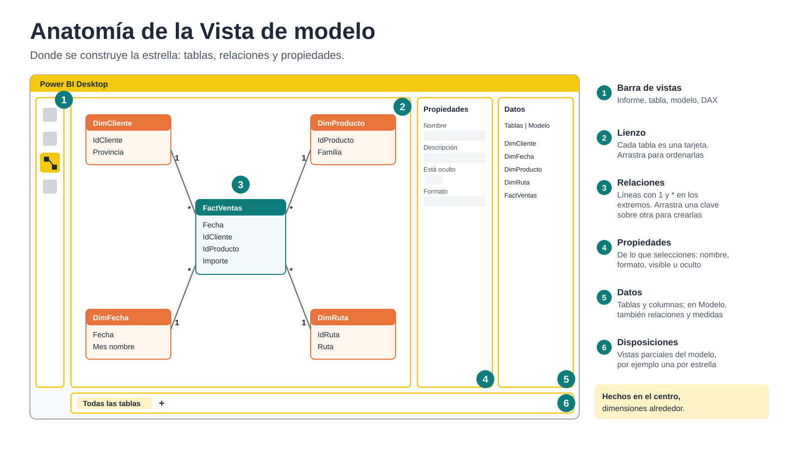
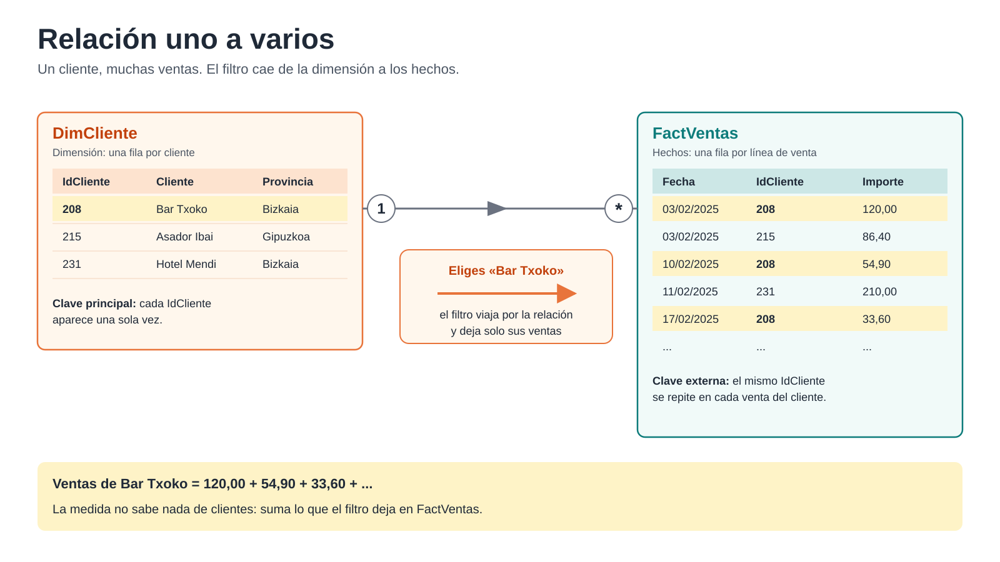
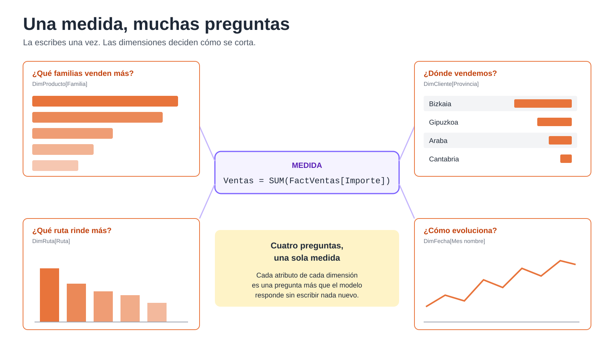
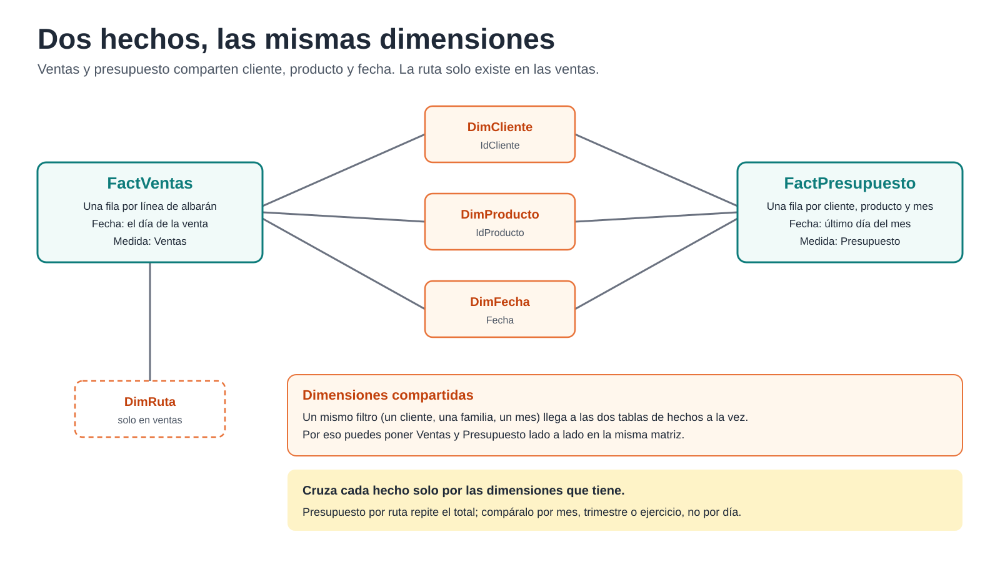

# 3. Modelado: el modelo en estrella

**En este capítulo:** qué es un modelo semántico, cómo se trabaja en la Vista de modelo, cómo se relacionan las tablas, por qué una sola medida responde a muchas preguntas, cómo se añade un calendario y cómo se incorpora una segunda tabla de hechos, el presupuesto.

**Punto de partida:** el archivo `Mi_Modelo_Ventas.pbix` que guardaste al final del capítulo 2. Si no lo terminaste, abre `C:\Curso-Power-BI-Basico-main\Proyecto Modelo de Ventas\Checkpoint_Cap2_PowerQuery.pbix` y guárdalo con el nombre `Mi_Modelo_Ventas.pbix`.

---

## 3.1 Qué es un modelo


En el capítulo 2 construiste cuatro tablas separadas: una de hechos (`FactVentas`) y tres de dimensiones (`DimCliente`, `DimProducto`, `DimRuta`). Por separado no sirven de mucho: `FactVentas` sabe que se vendieron 120 € al cliente 208, pero no sabe quién es el cliente 208 ni en qué provincia está.

El **modelo** es el conjunto de esas tablas, las **relaciones** que las unen y las **medidas** que calculan sobre ellas. Power BI lo llama **modelo semántico**: «semántico» porque traduce los datos al lenguaje del negocio. Quien use el informe no ve `idCliente` ni `nomCom`; ve **Cliente**, **Provincia** y **Ventas**.

En un **modelo en estrella**:

- La tabla de **hechos** queda en el centro. Tiene muchas filas, pocas columnas, y casi todo son importes, cantidades y claves.
- Las tablas de **dimensiones** la rodean. Tienen pocas filas y muchas columnas descriptivas: nombres, familias, provincias, meses.
- Cada dimensión se une a la tabla de hechos con **una relación**.

**Por qué en estrella y no en una tabla plana como la del capítulo 1:**

- Cada dato descriptivo se guarda **una sola vez**. El nombre de un cliente está en una fila de `DimCliente`, no repetido en cada una de sus miles de ventas.
- Puedes **añadir otra tabla de hechos** (el presupuesto, en este mismo capítulo) y analizarla con las mismas dimensiones.
- Las medidas son más sencillas y más rápidas.
- Es la estructura que esperan Power BI y, cada vez más, las herramientas de inteligencia artificial que consultan el modelo.

---

## 3.2 La Vista de modelo por dentro



Abre `Mi_Modelo_Ventas.pbix` y pulsa el icono de **Vista de modelo** en la barra de la izquierda.

1. **Barra de vistas.** Las mismas que en el capítulo 1: informe, tabla, modelo y consultas DAX.
2. **Lienzo.** Cada tabla aparece como una tarjeta con sus columnas. Puedes arrastrarlas para ordenarlas y contraer las que no necesites ver.
3. **Relaciones.** Las líneas entre tablas. En cada extremo verás un **1** o un **\*** (asterisco), y en medio una flecha que indica hacia dónde viaja el filtro.
4. **Panel Propiedades.** Muestra las propiedades de lo que tengas seleccionado: una tabla, una columna, una medida o una relación. Desde aquí cambias nombres, formatos y si algo es visible o no.
5. **Panel Datos.** Lista todas las tablas y, en la pestaña **Modelo**, todos los objetos del modelo: tablas, relaciones, medidas.
6. **Disposiciones.** Pestañas en la parte inferior. **Todas las tablas** muestra el modelo completo; con el **+** puedes crear vistas parciales, por ejemplo una por cada tabla de hechos.

### Antes de empezar: revisa lo que ha hecho Power BI solo

Por defecto, Power BI intenta adivinar relaciones al cargar datos, buscando columnas con el mismo nombre. A veces acierta y a veces no. Vamos a construir las relaciones nosotros, sabiendo qué hacemos:

1. **Inicio > Administrar relaciones.**
2. Si aparece alguna relación, selecciónala y pulsa **Eliminar**. Repite hasta que la lista quede vacía.
3. Para que no vuelva a pasar en este archivo: **Archivo > Opciones y configuración > Opciones > Archivo actual > Carga de datos** y desmarca **Detectar automáticamente nuevas relaciones después de cargar los datos**.

Aprovecha que estás en esa pantalla: en **Inteligencia de tiempo**, desmarca también **Fecha y hora automáticas**. Lo explicamos en el apartado 3.6.

---

## 3.3 Relaciones



Una relación une dos tablas a través de una columna que tienen en común.

- En la dimensión, esa columna es la **clave principal**: identifica cada fila y **no se repite**. En `DimCliente`, cada `IdCliente` aparece una sola vez.
- En la tabla de hechos, es la **clave externa**: indica a qué fila de la dimensión pertenece cada hecho, y **se repite** tantas veces como haga falta. Un cliente tiene muchas ventas.

Por eso casi todas las relaciones de un modelo en estrella son **de uno a varios** (1:\*): un cliente, muchas ventas; un producto, muchas ventas.

### La dirección del filtro

La flecha de la relación indica hacia dónde viaja el filtro: **del lado 1 al lado \***, de la dimensión a los hechos. Cuando en un informe eliges la provincia Bizkaia, el filtro se aplica a `DimCliente`, baja por la relación y deja en `FactVentas` solo las ventas de clientes de Bizkaia. La medida suma solo esas filas.

Es la idea más importante del capítulo: **el filtro cae de las dimensiones hacia los hechos.**

### Ejercicio 3.3.a · Crear las relaciones del modelo de ventas

1. En la Vista de modelo, coloca `FactVentas` en el centro y las tres dimensiones alrededor.
2. Arrastra la columna `IdCliente` de `FactVentas` y suéltala sobre `IdCliente` de `DimCliente`.
3. Se abre el cuadro de diálogo de la relación. Comprueba:
   - **Cardinalidad:** varios a uno (\*:1). `FactVentas` es el lado varios; `DimCliente`, el lado uno.
   - **Dirección del filtro cruzado:** única.
   - **Activar esta relación:** marcado.
4. Pulsa **Aceptar**.
5. Repite con `IdProducto` (`FactVentas` con `DimProducto`) e `IdRuta` (`FactVentas` con `DimRuta`).

También puedes crear relaciones desde **Inicio > Administrar relaciones > Nuevo**, eligiendo las dos tablas y sus columnas.

> **Si Power BI propone «varios a varios» (\*:\*)**, es que la columna de la dimensión tiene valores repetidos. No aceptes: vuelve a Power Query y revisa la dimensión. En un modelo en estrella, cada dimensión tiene una fila por cada valor de su clave.

> **Si no te deja relacionar dos columnas**, comprueba que tienen el mismo tipo de dato. Un `IdCliente` como texto en una tabla y como número en la otra no se pueden relacionar.

### Relaciones activas e inactivas

Entre dos tablas solo puede haber **una relación activa**, que se dibuja con línea continua. Si creas una segunda, Power BI la deja **inactiva**, con línea discontinua: existe, pero no filtra salvo que una medida la active expresamente. Las verás en el capítulo de DAX; por ahora, basta con reconocerlas.

---

## 3.4 Una medida, muchas preguntas



Aquí está la potencia del modelo: escribes una medida **una sola vez** y la cruzas con cualquier atributo de cualquier dimensión.

### Ejercicio 3.4.a · Cruzar la medida Ventas

1. Ve a la **Vista de informe**. Selecciona `FactVentas` en el panel **Datos** y pulsa **Inicio > Nueva medida**:

   ```
   Ventas = SUM ( FactVentas[Importe] )
   ```

2. Inserta un objeto visual **Matriz**. Arrastra `Familia` (de `DimProducto`) a **Filas** y la medida `Ventas` a **Valores**.
3. Cambia `Familia` por `Provincia` (de `DimCliente`). Después por `Ruta` (de `DimRuta`).
4. Pon `Provincia` en **Filas** y `Familia` en **Columnas**. Has cruzado dos dimensiones distintas con la misma medida, sin escribir nada más.

No has creado una medida de «ventas por familia» ni otra de «ventas por provincia». Has creado **Ventas**, y el modelo se encarga del resto: cada fila de la matriz filtra su dimensión, el filtro baja por la relación y la medida suma lo que queda.

### Ejercicio 3.4.b · ¿Qué pasa sin relación?

1. En la Vista de modelo, selecciona la relación entre `FactVentas` y `DimRuta` y pulsa **Supr**. Confirma.
2. Vuelve a la matriz con `Ruta` en **Filas**.

Todas las rutas muestran **la misma cifra**: el total de ventas. Sin relación, el filtro de la ruta no tiene por dónde llegar a `FactVentas`, y la medida suma todo en cada fila.

> **Cuando veas la misma cifra repetida en todas las filas**, piensa primero en una relación que falta o en un filtro que no llega a la tabla de hechos.

3. Vuelve a crear la relación entre `FactVentas[IdRuta]` y `DimRuta[IdRuta]`.

---

## 3.5 Datos que no cuadran: «(En blanco)»

Con `Ruta` en las filas de la matriz, observa la primera fila: **(En blanco)**, con unos 766 €.

Son las ventas de los albaranes con `IdRuta` = 0 que detectaste en el capítulo 2. Ese valor no existe en `DimRuta`, así que esas ventas no encuentran su ruta. Power BI no las pierde: las agrupa en una fila **(En blanco)** para que el total siga cuadrando.

«(En blanco)» no es un error de Power BI, es un aviso: **hay hechos que no encuentran su dimensión**. La solución correcta no está en el informe, sino en los datos: que la dimensión tenga una fila para ese caso.

### Ejercicio 3.5.a · Añadir la ruta «Sin ruta»

1. **Inicio > Transformar datos** para abrir Power Query.
2. **Inicio > Introducir datos.** Crea una tabla con dos columnas:

   | IdRuta | Ruta |
   |---|---|
   | 0 | Sin ruta |

   Llámala `RutaSinAsignar` y pulsa **Aceptar**.
3. Cambia el tipo de `IdRuta` a **Número entero**, el mismo que en `DimRuta`.
4. Mueve `RutaSinAsignar` al grupo `1. Origen` y desmarca **Habilitar carga**.
5. Selecciona `DimRuta` > **Inicio > Anexar consultas** y elige `RutaSinAsignar`. Como las columnas se llaman igual, la fila se añade al final.
6. **Inicio > Cerrar y aplicar.**

Vuelve a la matriz: la fila **(En blanco)** ha desaparecido y en su lugar aparece **Sin ruta**, con las mismas ventas.

> En `DimProducto` ya hiciste algo parecido con **Sin familia**. Es una buena costumbre: cada dimensión debería tener una fila para «sin asignar», con un nombre que entienda quien lea el informe.

---

## 3.6 La tabla calendario

Casi todo análisis de negocio mira el tiempo: ventas por mes, por trimestre, este año frente al anterior. Para eso el modelo necesita una dimensión de fechas: **DimFecha**, con una fila por cada día y columnas como año, mes o trimestre.

**Por qué no basta con la columna `Fecha` de `FactVentas`:**

- Solo tiene los días en que hubo ventas. Un calendario necesita **todos** los días, sin huecos.
- Las funciones de inteligencia de tiempo de DAX (año anterior, acumulado del año) necesitan una tabla de fechas completa.
- Cuando añadas el presupuesto, ventas y presupuesto tienen que compartir **el mismo** calendario para poder compararse.

Por eso, en el apartado 3.2, desactivaste **Fecha y hora automáticas**: esa opción crea calendarios ocultos, uno por cada columna de fecha, que ocupan memoria y no se pueden compartir entre tablas.

### Ejercicio 3.6.a · Crear DimFecha

1. En la **Vista de tabla**, **Herramientas de tabla > Nueva tabla**, y escribe:

   ```
   DimFecha =
   VAR _AnyoFechaInicio = YEAR ( MIN ( FactVentas[Fecha] ) )
   VAR _AnyoFechaFin    = YEAR ( MAX ( FactVentas[Fecha] ) )
   VAR Base =
       CALENDAR ( DATE ( _AnyoFechaInicio, 1, 1 ), DATE ( _AnyoFechaFin, 12, 31 ) )
   RETURN
   ADDCOLUMNS (
       SELECTCOLUMNS ( Base, "Fecha", [Date] ),
       "Ejercicio",     YEAR ( [Fecha] ),
       "Mes nº",        MONTH ( [Fecha] ),
       "Mes corto",     FORMAT ( [Fecha], "mmm" ),
       "Mes nombre",    FORMAT ( [Fecha], "mmmm" ),
       "Trimestre",     "Q" & QUARTER ( [Fecha] ),
       "Ejercicio Mes", FORMAT ( [Fecha], "yyyy-MM" ),
       "Semana nº",     WEEKNUM ( [Fecha], 21 )
   )
   ```

   No hace falta que entiendas cada línea todavía. Lo importante: toma el primer y el último año de las ventas, crea todos los días desde el 1 de enero del primero hasta el 31 de diciembre del último, y añade una columna por cada forma de agrupar el tiempo.

2. Comprueba en la Vista de tabla que `DimFecha` va del 1 de enero de 2024 al 31 de diciembre de 2025: 731 filas.

### Ejercicio 3.6.b · Marcarla como tabla de fechas

1. Selecciona `DimFecha` > **Herramientas de tabla > Marcar como tabla de fechas**.
2. Elige la columna `Fecha`. Power BI comprueba que no tiene huecos ni repetidos.

Así le dices a Power BI que esta es la tabla de fechas del modelo, la que deben usar las funciones de tiempo.

### Ejercicio 3.6.c · Ordenar los meses

Pon `Mes nombre` en las filas de una matriz: los meses salen por orden alfabético (abril, agosto, diciembre...).

1. En la Vista de tabla, selecciona la columna `Mes nombre`.
2. **Herramientas de columna > Ordenar por columna > Mes nº**.
3. Repite con `Mes corto`.

Ahora los meses siguen el orden del calendario en cualquier objeto visual.

### Ejercicio 3.6.d · Relacionar el calendario

1. En la Vista de modelo, relaciona `DimFecha[Fecha]` con `FactVentas[Fecha]`: uno a varios, filtro en dirección única.
2. En la matriz, pon `Ejercicio` y `Mes nombre` en **Filas** y `Ventas` en **Valores**.

> Para que la relación funcione, `FactVentas[Fecha]` tiene que ser de tipo **Fecha**, no **Fecha y hora**. Una fecha con hora (por ejemplo, 15/03/2025 10:30) no encuentra su día en el calendario. Por eso definiste el tipo en Power Query.

---

## 3.7 Una segunda tabla de hechos: el presupuesto



La dirección quiere comparar las ventas de 2025 con lo presupuestado. El presupuesto está en otro archivo y tiene otro nivel de detalle:

| | FactVentas | FactPresupuesto |
|---|---|---|
| Una fila por... | línea de albarán | cliente, producto y mes |
| Fecha | día de la venta | último día de cada mes |
| Ruta | sí | no |

Este nivel de detalle se llama **granularidad**. Las dos tablas son hechos, pero no se pueden juntar en una sola: el presupuesto no tiene albaranes ni días. La solución es tener **dos tablas de hechos** que compartan las mismas dimensiones.

### Ejercicio 3.7.a · Preparar FactPresupuesto en Power Query

1. **Inicio > Transformar datos**, y en Power Query, **Inicio > Nuevo origen > Libro de Excel** > `C:\Curso-Power-BI-Basico-main\Proyecto Modelo de Ventas\Presupuesto_Ventas_2025.xlsx`. Marca la **tabla** `Ppto_2025` y pulsa **Aceptar**.
2. Renombra la consulta como `FactPresupuesto` y muévela al grupo `3. Hechos`.
3. Quita la columna `Nombre producto`. El nombre del producto es un atributo de la dimensión y ya está en `DimProducto`; en la tabla de hechos basta con la clave.
4. Revisa tipos: `idCliente` e `idProducto` como **Número entero**, `Fecha` como **Fecha**, `Ppto Ventas` y `Ppto Coste` como **Número decimal**.
5. Renombra: `idCliente` → `IdCliente`, `idProducto` → `IdProducto`, `Ppto Ventas` → `ImportePpto`, `Ppto Coste` → `CostePpto`.
6. **Inicio > Cerrar y aplicar.**

> `IdProducto` del presupuesto es el número de posición del producto en la tabla de productos. Por eso en el capítulo 2 creaste `IdProducto` con una columna de índice justo después de elegir columnas: ahora las dos tablas de hechos usan la misma clave.

### Ejercicio 3.7.b · Relacionar el presupuesto

En la Vista de modelo, crea tres relaciones de uno a varios:

1. `DimCliente[IdCliente]` con `FactPresupuesto[IdCliente]`.
2. `DimProducto[IdProducto]` con `FactPresupuesto[IdProducto]`.
3. `DimFecha[Fecha]` con `FactPresupuesto[Fecha]`.

`DimRuta` no se relaciona con el presupuesto: el presupuesto no tiene ruta.

Las dimensiones que comparten varias tablas de hechos se llaman **dimensiones compartidas** (o conformadas). Un modelo con varias estrellas que comparten dimensiones se suele llamar **constelación**.

### Ejercicio 3.7.c · Ventas frente a presupuesto

1. Crea la medida, en `FactPresupuesto`:

   ```
   Presupuesto = SUM ( FactPresupuesto[ImportePpto] )
   ```

2. Crea una matriz con `Familia` en **Filas** y `Ventas` y `Presupuesto` en **Valores**. Añade una segmentación de `Ejercicio` y elige 2025.
3. Cambia `Familia` por `Cliente` y después por `Mes nombre`. Las dos medidas responden al mismo filtro, porque las dos tablas de hechos comparten las dimensiones.
4. Ahora cambia a `Ruta`. Fíjate en la columna `Presupuesto`: repite el total en todas las filas.

Es lo mismo que viste en el ejercicio 3.4.b: no hay relación entre `DimRuta` y `FactPresupuesto`, porque el presupuesto no se hizo por rutas. No es un error que haya que corregir, sino un límite de los datos: **solo puedes cruzar un hecho por las dimensiones que tiene**. Cuando diseñes informes, combina cada medida solo con las dimensiones que le corresponden.

> **Cuidado con el día.** El presupuesto está en el último día de cada mes. Si analizas por día o por semana, el presupuesto de todo el mes aparecerá concentrado en un solo día. Compara ventas y presupuesto por **mes**, **trimestre** o **ejercicio**: la granularidad que comparten.

---

## 3.8 Deja el modelo listo para usar

Un modelo no lo usas solo tú: lo usarán otras personas que construyan informes y, cada vez más, herramientas de inteligencia artificial que lo consultan en lenguaje natural. Cuanto más claro esté, mejores respuestas darán unos y otros.

### Ejercicio 3.8.a · Ocultar lo que no hay que usar

Las claves de las tablas de hechos (`IdCliente`, `IdProducto`, `IdRuta` y `Fecha` en `FactVentas`; `IdCliente`, `IdProducto` y `Fecha` en `FactPresupuesto`) solo sirven para las relaciones. Si alguien las usa en un informe, filtrará la tabla de hechos en lugar de la dimensión, y la otra tabla de hechos no se enterará.

1. En la Vista de modelo, selecciona esas columnas (con **Ctrl** para elegir varias).
2. En el panel **Propiedades**, activa **Está oculto**, o haz clic derecho > **Ocultar en la vista de informe**.

Oculta también las columnas de importe de las tablas de hechos (`Importe`, `Coste`, `ImportePpto`, `CostePpto`) una vez que tengas sus medidas: quien construya un informe debe usar las medidas, no las columnas.

**La regla:** de las tablas de hechos, solo se ven las medidas. Todo lo que sirve para filtrar o agrupar se toma de las dimensiones.

### Ejercicio 3.8.b · Nombres, formatos y resumen

1. **Nombres:** revisa que todo lo visible tenga un nombre de negocio. `Ruta`, no `Descripción ruta`.
2. **Formatos:** selecciona la medida `Ventas` y, en **Herramientas de medidas**, elige formato moneda con dos decimales. Haz lo mismo con `Presupuesto`.
3. **Resumen:** las columnas numéricas que no se suman (por ejemplo `Ejercicio` o `Mes nº` en `DimFecha`) deben tener en **Propiedades > Resumir por** la opción **Ninguno**. Si no, al arrastrarlas a un objeto visual Power BI las sumará: 2024 + 2025 = 4049.

### Ejercicio 3.8.c · Una tabla para las medidas

Cuando un modelo tiene muchas medidas, conviene reunirlas en una tabla propia, en lugar de tenerlas repartidas entre las tablas de hechos.

1. **Inicio > Introducir datos.** Llama a la tabla `_Medidas` y pulsa **Cargar** sin escribir nada.
2. Selecciona la medida `Ventas` y, en **Herramientas de medidas > Tabla principal**, elige `_Medidas`. Repite con `Presupuesto`.
3. Elimina la columna vacía que trae `_Medidas` (`Columna1`).

La tabla aparecerá en la parte de arriba del panel **Datos**, con el icono de una calculadora.

### Ejercicio 3.8.d · Disposiciones

1. En la Vista de modelo, pulsa el **+** junto a **Todas las tablas** para crear una disposición nueva. Llámala `Ventas`.
2. Arrastra `FactVentas` desde el panel **Datos** al lienzo, haz clic derecho sobre ella y elige **Agregar tablas relacionadas**.
3. Crea otra disposición, `Presupuesto`, con `FactPresupuesto` y sus tablas relacionadas.

Cada disposición muestra una estrella. Cuando el modelo crezca, es la forma de no perderte.

Guarda `Mi_Modelo_Ventas.pbix`. Es el punto de partida del capítulo 4.

---

## 3.9 Errores comunes y repaso

| Síntoma | Causa probable | Qué hacer |
|---|---|---|
| La misma cifra en todas las filas | Falta la relación entre esa dimensión y la tabla de hechos | Crear la relación, o no cruzar esa medida con esa dimensión |
| Aparece una fila «(En blanco)» | Hay hechos con una clave que no existe en la dimensión | Añadir a la dimensión una fila «Sin asignar» |
| Power BI propone una relación varios a varios | La clave de la dimensión tiene valores repetidos | Revisar la dimensión en Power Query hasta que tenga una fila por clave |
| No se pueden relacionar dos columnas | Tienen tipos de dato distintos | Igualar el tipo en Power Query |
| Los meses salen por orden alfabético | Falta ordenar por columna | **Ordenar por columna > Mes nº** |
| La fecha no encuentra su día en el calendario | La columna es Fecha y hora | Cambiar el tipo a **Fecha** en Power Query |
| Un año aparece sumado (4049) | La columna numérica se resume por suma | **Resumir por > Ninguno** |

**Para saber más.** Hay situaciones que no verás en este curso básico, pero conviene reconocer por su nombre: las relaciones **varios a varios**, los filtros en **ambas direcciones** y los modelos en **copo de nieve** (dimensiones que dependen de otras dimensiones, como habría sido dejar `familia` como tabla aparte). Todas tienen su uso, pero también sus riesgos. Mientras puedas, quédate con la estrella: relaciones de uno a varios, filtro en una dirección, dimensiones planas.

**Lo que te llevas de este capítulo:** un modelo es tablas, relaciones y medidas. El filtro cae de las dimensiones a los hechos, y por eso una sola medida responde a tantas preguntas como atributos tengan tus dimensiones. Con un calendario y dimensiones compartidas, puedes comparar hechos distintos, como las ventas y el presupuesto, en el mismo informe.
