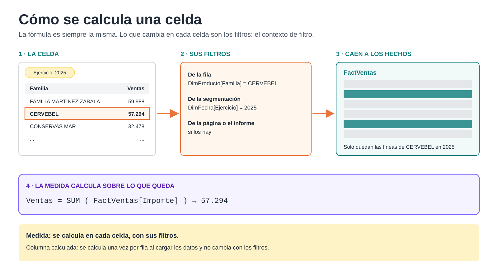
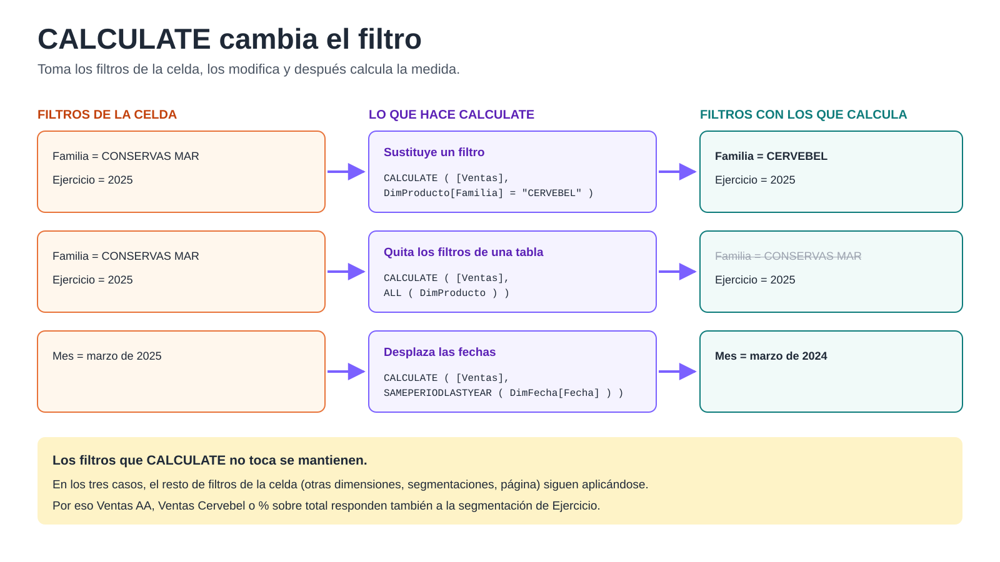
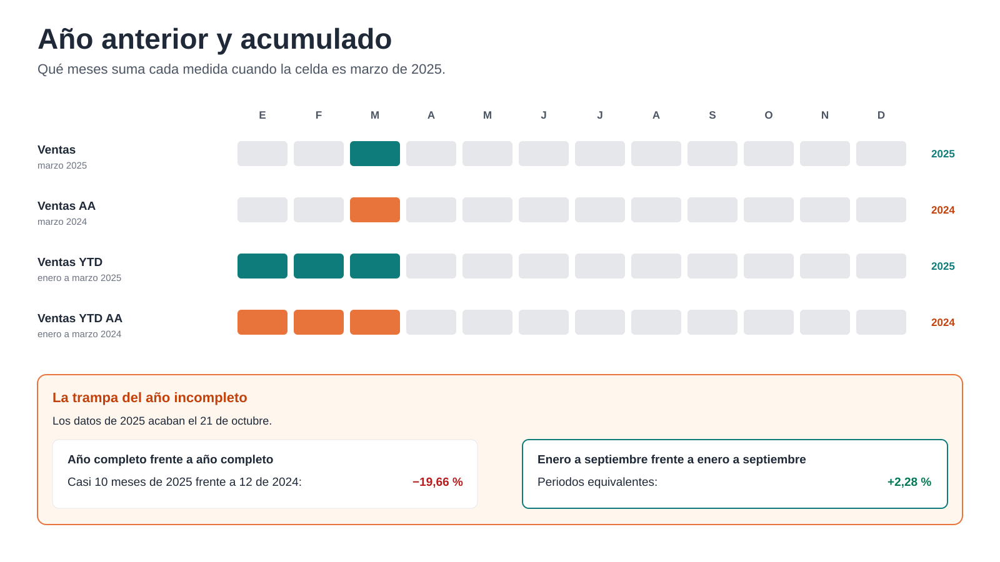

# 4. Medidas con DAX

**En este capítulo:** qué es una medida y cómo calcula Power BI cada celda de un objeto visual, las medidas básicas de ventas y margen, la función CALCULATE, la comparación con el presupuesto y la comparación con el año anterior.

**Punto de partida:** `Mi_Modelo_Ventas.pbix`, tal como lo dejaste al final del capítulo 3. Si no lo terminaste, abre `C:\Curso-Power-BI-Basico-main\Proyecto Modelo de Ventas\Checkpoint_Cap3_Modelo.pbix` y guárdalo con el nombre `Mi_Modelo_Ventas.pbix`.

**DAX** es el lenguaje de las fórmulas de Power BI. Se parece a las fórmulas de Excel, pero con una diferencia importante: no trabaja con celdas, sino con tablas y columnas. Todas las medidas de este capítulo se crean en la tabla `_Medidas`: selecciónala en el panel **Datos** antes de pulsar **Inicio > Nueva medida**.

---

## 4.1 Medida o columna calculada



En Power BI hay dos formas de calcular con DAX:

- Una **columna calculada** añade una columna a una tabla y calcula un valor **para cada fila**, al cargar los datos. Ocupa memoria y no cambia con los filtros.
- Una **medida** no se guarda en ninguna tabla. Se calcula **en el momento**, para cada celda de cada objeto visual, con los filtros que tenga esa celda.

Cuando pones `Ventas` en una matriz con `Familia` en las filas y una segmentación de `Ejercicio` en 2025, la celda de CERVEBEL se calcula así:

1. Reúne todos los filtros que le afectan: la fila (Familia = CERVEBEL), la segmentación (Ejercicio = 2025) y cualquier filtro de la página.
2. Esos filtros caen de las dimensiones a `FactVentas`, por las relaciones.
3. La medida suma `Importe` solo en las filas que quedan.

Ese conjunto de filtros de cada celda se llama **contexto de filtro**. Es la idea clave de DAX: la fórmula es siempre la misma; lo que cambia en cada celda es el contexto.

### Ejercicio 4.1.a · Ver la diferencia

1. En la **Vista de tabla**, selecciona `FactVentas` > **Herramientas de tabla > Nueva columna**:

   ```
   Margen línea = FactVentas[Importe] - FactVentas[Coste]
   ```

   Aparece una columna nueva con un valor en cada línea de venta.
2. Ahora crea la medida equivalente, en `_Medidas`:

   ```
   Coste = SUM ( FactVentas[Coste] )
   ```

   ```
   Margen = [Ventas] - [Coste]
   ```

   La medida no aparece en ninguna tabla. Solo la verás funcionar cuando la pongas en un objeto visual.
3. Elimina la columna `Margen línea` (clic derecho > **Eliminar**).

**Regla práctica:** si el resultado depende de lo que el usuario filtra (totales, porcentajes, comparaciones), es una **medida**. En este curso no necesitarás columnas calculadas: lo que haga falta por fila se prepara en Power Query.

> Fíjate en que `Margen` usa otras medidas, `[Ventas]` y `[Coste]`, escritas entre corchetes y sin nombre de tabla. Construir medidas a partir de otras evita repetir fórmulas: si un día cambia cómo se calculan las ventas, solo tocas una.

---

## 4.2 Las medidas básicas

### Ejercicio 4.2.a · Margen, cantidad y clientes

Crea estas medidas en `_Medidas`:

```
% Margen = DIVIDE ( [Margen], [Ventas] )
```

```
Cantidad = SUM ( FactVentas[Cantidad] )
```

```
Nº clientes = DISTINCTCOUNT ( FactVentas[IdCliente] )
```

- **DIVIDE** divide como `/`, pero si el denominador es cero devuelve un valor en blanco en lugar de un error. Úsala siempre para dividir.
- **DISTINCTCOUNT** cuenta valores distintos: cuántos clientes diferentes han comprado, no cuántas líneas tienen.

### Ejercicio 4.2.b · Formatos

1. Selecciona `% Margen` y, en **Herramientas de medidas**, elige formato **porcentaje** con **2 decimales**.
2. `Coste` y `Margen`: moneda, 2 decimales. `Cantidad` y `Nº clientes`: número entero.

### Ejercicio 4.2.c · Comprobar

Crea una matriz con `Ejercicio` en **Filas** y `Ventas`, `Coste`, `Margen`, `% Margen`, `Cantidad` y `Nº clientes` en **Valores**. Deberías ver un margen del 21,79 % en 2024 y del 26,17 % en 2025.

Añade `Familia` debajo de `Ejercicio` en las filas. Fíjate en la fila de total de cada año: el `% Margen` no es la suma de los porcentajes de las familias, sino el margen total dividido entre las ventas totales. Como es una medida, se recalcula en cada celda con su propio contexto. Por eso un porcentaje nunca se guarda en una columna para luego sumarlo.

---

## 4.3 CALCULATE: cambiar el filtro



Hasta ahora, las medidas aceptan el contexto de filtro tal como llega. **CALCULATE** permite **modificarlo**: calcula una expresión con los filtros que le indicas, añadiendo, sustituyendo o quitando filtros.

```
CALCULATE ( expresión, filtro1, filtro2, ... )
```

Es la función más importante de DAX. Casi todas las medidas avanzadas la usan.

### Ejercicio 4.3.a · Sustituir un filtro

```
Ventas Cervebel = CALCULATE ( [Ventas], DimProducto[Familia] = "CERVEBEL" )
```

1. Ponla en la matriz junto a `Ventas`, con `Familia` en las filas.
2. Todas las filas muestran la misma cifra: las ventas de CERVEBEL. CALCULATE ha **sustituido** el filtro de la fila (cada familia) por el suyo (CERVEBEL).
3. Cambia la segmentación de `Ejercicio`: la cifra sí cambia. CALCULATE solo sustituye el filtro sobre `Familia`; los demás filtros se mantienen.

### Ejercicio 4.3.b · Quitar un filtro: el peso de cada familia

```
Ventas todas las familias = CALCULATE ( [Ventas], ALL ( DimProducto ) )
```

```
% sobre total = DIVIDE ( [Ventas], [Ventas todas las familias] )
```

1. **ALL** quita todos los filtros de la tabla que le indicas. `Ventas todas las familias` devuelve en cada fila el total de todas las familias.
2. Dale a `% sobre total` formato porcentaje con 2 decimales y ponlo en la matriz.
3. Con 2025 seleccionado, FAMILIA MARTINEZ ZABALA pesa un 14,43 % y CERVEBEL un 13,78 %. El total suma 100,00 %.
4. Cambia `Familia` por `Provincia` en las filas. Ahora todas las filas muestran 100,00 %: ALL quita los filtros de `DimProducto`, pero el filtro de cada provincia está en `DimCliente` y se mantiene, así que cada provincia se divide entre sí misma. Para el peso de cada provincia haría falta `ALL ( DimCliente )`. Cada medida de este tipo se diseña para una dimensión concreta.

Cuando hayas terminado, elimina `Ventas Cervebel`: solo servía para entender CALCULATE.

---

## 4.4 Ventas frente a presupuesto

En el capítulo 3 creaste la medida `Presupuesto`. Ahora la comparamos con las ventas.

### Ejercicio 4.4.a · GAP y % GAP

```
GAP = [Ventas] - [Presupuesto]
```

```
% GAP = DIVIDE ( [GAP], [Presupuesto] )
```

El **GAP** es la diferencia entre lo vendido y lo presupuestado: positivo si vendes más de lo previsto, negativo si vendes menos. Formato: `GAP` en moneda y `% GAP` en porcentaje, ambos con 2 decimales.

### Ejercicio 4.4.b · Comparar lo que es comparable

1. Crea una matriz con `Mes nombre` en **Filas** y `Ventas`, `Presupuesto`, `GAP` y `% GAP` en **Valores**, con la segmentación de `Ejercicio` en 2025.
2. Fíjate en noviembre y diciembre: hay presupuesto pero no ventas, porque los datos acaban el 21 de octubre de 2025. Y octubre está incompleto.
3. Añade una segmentación de `Mes nombre` y selecciona de enero a septiembre, los meses completos. Observa el total.

> **Compara siempre periodos equivalentes.** Si sumas el presupuesto del año entero frente a las ventas de diez meses, el GAP sale enorme y no significa nada.

Aun comparando meses completos, el resultado es llamativo: de enero a septiembre de 2025 las ventas quedan un 51,67 % por debajo del presupuesto, y el presupuesto es el mismo todos los meses. Un informe no corrige un presupuesto: lo hace visible. ¿Qué preguntas le harías a quien lo preparó?

### Ejercicio 4.4.c · Formato condicional

1. En la matriz, en el panel **Visualizaciones**, haz clic en la flecha junto a `% GAP` en **Valores** > **Formato condicional > Color de fuente**.
2. **Estilo de formato:** Reglas. Si el valor es **menor que 0**, rojo; si es **mayor o igual que 0**, verde.
3. Pulsa **Aceptar**.

Ahora los meses en los que no se llega al presupuesto se ven de un vistazo.

---

## 4.5 Comparar con el año anterior



Las funciones de **inteligencia de tiempo** desplazan el filtro de fechas: «el mismo periodo del año anterior», «desde el 1 de enero hasta hoy». Funcionan gracias a `DimFecha`, la tabla de fechas que marcaste en el capítulo 3.

### Ejercicio 4.5.a · Ventas del año anterior

```
Ventas AA = CALCULATE ( [Ventas], SAMEPERIODLASTYEAR ( DimFecha[Fecha] ) )
```

```
Var. Ventas = [Ventas] - [Ventas AA]
```

```
% Var. Ventas = DIVIDE ( [Var. Ventas], [Ventas AA] )
```

**AA** significa «año anterior». Otra vez CALCULATE: esta vez cambia el filtro de fechas por las mismas fechas un año antes. Si la celda es marzo de 2025, `Ventas AA` calcula marzo de 2024.

1. Crea una matriz con `Ejercicio` y `Mes nombre` en **Filas**, y `Ventas`, `Ventas AA` y `% Var. Ventas` en **Valores**.
2. En 2024, `Ventas AA` sale en blanco: no hay datos de 2023.
3. En 2025, compara mes a mes.

### Ejercicio 4.5.b · Acumulado del año

```
Ventas YTD = TOTALYTD ( [Ventas], DimFecha[Fecha] )
```

```
Ventas YTD AA = CALCULATE ( [Ventas YTD], SAMEPERIODLASTYEAR ( DimFecha[Fecha] ) )
```

**YTD** (*year to date*) es el acumulado desde el 1 de enero hasta la fecha de cada celda. En la fila de marzo, `Ventas YTD` suma enero, febrero y marzo.

Añádelas a la matriz y comprueba que en diciembre de 2024 `Ventas YTD` coincide con el total del año.

### Ejercicio 4.5.c · La trampa del año incompleto

1. Crea una matriz solo con `Ejercicio` en **Filas** y `Ventas`, `Ventas AA` y `% Var. Ventas`.
2. 2025 sale con una caída del 19,66 %. Parece una mala noticia.
3. Añade la segmentación de `Mes nombre` y selecciona de enero a septiembre.
4. Ahora 2025 crece un 2,28 %.

Los dos números son correctos, pero solo el segundo responde a la pregunta. El primero compara algo menos de diez meses de 2025 con los doce de 2024. **Antes de leer una variación, comprueba que los dos periodos son equivalentes.**

---

## 4.6 Ordenar las medidas

Con más de quince medidas, el panel **Datos** empieza a ser difícil de leer. Además, si alguien (o una herramienta de IA) va a usar el modelo, necesita saber qué calcula cada medida.

### Ejercicio 4.6.a · Carpetas y descripciones

1. En la **Vista de modelo**, selecciona `Ventas`, `Coste`, `Margen`, `% Margen`, `Cantidad`, `Nº clientes` y `% sobre total` (con **Ctrl**).
2. En el panel **Propiedades**, escribe en **Carpeta para mostrar**: `1. Ventas`.
3. Repite con `Presupuesto`, `GAP` y `% GAP` en `2. Presupuesto`, y con `Ventas AA`, `Var. Ventas`, `% Var. Ventas`, `Ventas YTD` y `Ventas YTD AA` en `3. Comparación temporal`.
4. Oculta `Ventas todas las familias`: es una medida auxiliar que solo usa `% sobre total`.
5. Selecciona `% GAP` y escribe en **Descripción**: «Diferencia entre ventas y presupuesto, en porcentaje sobre el presupuesto. Negativo: por debajo del presupuesto.» Hazlo también con las medidas que creas que pueden confundir.

La descripción aparece al pasar el ratón sobre la medida y es lo que lee la IA del capítulo 6 para entender tu modelo.

Guarda `Mi_Modelo_Ventas.pbix`.

---

## 4.7 Errores comunes y repaso

| Síntoma | Causa probable | Qué hacer |
|---|---|---|
| Un porcentaje total que no tiene sentido | Se ha sumado una columna de porcentajes | Calcular el porcentaje con una medida y DIVIDE |
| Error de división entre cero | Se ha usado `/` | Usar DIVIDE |
| Una medida da la misma cifra en todas las filas | CALCULATE o ALL sustituyen el filtro de esa dimensión, o falta una relación | Revisar la fórmula y el modelo |
| `Ventas AA` en blanco | No hay datos del año anterior, o la tabla de fechas no está marcada | Comprobar los datos y **Marcar como tabla de fechas** |
| Una variación enorme que no cuadra con la realidad | Se comparan periodos distintos (un año incompleto) | Filtrar periodos equivalentes |

| Función | Para qué |
|---|---|
| `SUM` | Sumar una columna |
| `DISTINCTCOUNT` | Contar valores distintos |
| `DIVIDE` | Dividir sin errores |
| `CALCULATE` | Calcular con un filtro distinto |
| `ALL` | Quitar los filtros de una tabla |
| `SAMEPERIODLASTYEAR` | Mismo periodo del año anterior |
| `TOTALYTD` | Acumulado desde el 1 de enero |

**Lo que te llevas de este capítulo:** una medida se calcula en cada celda con su propio contexto de filtro. Con unas pocas funciones (SUM, DIVIDE, CALCULATE y las de tiempo) construyes las medidas que responden a casi todas las preguntas de negocio: cuánto vendemos, con qué margen, frente a qué presupuesto y frente a qué año.
