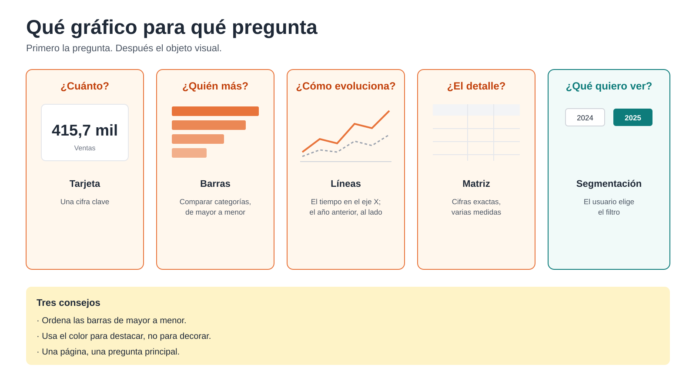

# 5. Visualización

**En este capítulo:** cómo elegir el objeto visual adecuado para cada pregunta, cómo construir una página de inicio con los indicadores principales y cómo crear una página de detalle a la que se llega con un clic.

**Punto de partida:** `Mi_Modelo_Ventas.pbix`, tal como lo dejaste al final del capítulo 4. Si no lo terminaste, abre `C:\Curso-Power-BI-Basico-main\Proyecto Modelo de Ventas\Checkpoint_Cap4_DAX.pbix` y guárdalo con el nombre `Mi_Modelo_Ventas.pbix`.

Este capítulo es corto a propósito. Con un buen modelo y buenas medidas, construir un informe es rápido: arrastrar medidas y atributos a objetos visuales. Lo difícil ya está hecho.

---

## 5.1 De la pregunta al gráfico

Antes de elegir un objeto visual, formula la pregunta que tiene que responder. Casi todas encajan en uno de estos casos:

| Pregunta | Objeto visual | Ejemplo |
|---|---|---|
| ¿Cuánto? Una sola cifra | **Tarjeta** | Ventas de 2025 |
| ¿Quién vende más? Comparar categorías | **Gráfico de barras** (horizontal) | Ventas por familia, ordenadas |
| ¿Cómo evoluciona? A lo largo del tiempo | **Gráfico de líneas** | Ventas por mes frente al año anterior |
| ¿Cuál es el detalle? Ver cifras exactas | **Matriz** | Ventas, margen y presupuesto por cliente |
| ¿Qué quiero ver? Elegir el filtro | **Segmentación** | Ejercicio, mes, familia |

Tres consejos que mejoran casi cualquier informe:

- **Ordena las barras** de mayor a menor. Nadie busca las familias por orden alfabético.
- **Pocos colores.** Usa el color para destacar algo (lo que está por debajo del presupuesto), no para decorar.
- **Una página, una pregunta principal.** Si una página intenta responderlo todo, no responde nada.

---

## 5.2 La página de inicio

### Ejercicio 5.2.a · Los indicadores

1. Renombra la primera página como `Inicio` (doble clic en la pestaña de la parte inferior).
2. Inserta cuatro objetos visuales **Tarjeta**, uno con cada medida: `Ventas`, `% Margen`, `% GAP` y `% Var. Ventas`.
3. Colócalas en fila en la parte superior de la página.

### Ejercicio 5.2.b · Las segmentaciones

1. Inserta una **Segmentación** con `Ejercicio` y otra con `Mes nombre`.
2. En el formato de la segmentación de `Ejercicio`, elige el estilo **Mosaico**, para que los años se vean como botones.
3. Selecciona 2025 y los meses de enero a septiembre. Las cuatro tarjetas se recalculan.

### Ejercicio 5.2.c · Evolución mensual

1. Inserta un **Gráfico de líneas**.
2. **Eje X:** `Mes nombre`. **Eje Y:** `Ventas` y `Ventas AA`.
3. Comprueba que los meses salen en orden de calendario: lo configuraste en el capítulo 3 con **Ordenar por columna**.

### Ejercicio 5.2.d · Ranking de familias

1. Inserta un **Gráfico de barras agrupadas** (barras horizontales).
2. **Eje Y:** `Familia`. **Eje X:** `Ventas`.
3. Ordénalo de mayor a menor: en los tres puntos (**...**) del objeto visual > **Ordenar eje > Ventas** y **Orden descendente**.

### Ejercicio 5.2.e · Todo está conectado

Haz clic en la barra de CERVEBEL. Las tarjetas y el gráfico de líneas se filtran: ahora muestran solo esa familia. Vuelve a hacer clic para quitar el filtro.

Es el mismo mecanismo de siempre: tu clic filtra `DimProducto`, el filtro cae a los hechos y todas las medidas se recalculan. El informe no sabe nada de familias ni de clientes; lo sabe el modelo.

> Si quieres que un objeto visual no se filtre al hacer clic en otro, selecciona el que filtra y usa **Formato > Editar interacciones**.

---

## 5.3 Obtener detalles: una página por cliente

Una página de inicio responde «¿cómo vamos?». Cuando algo llama la atención, la siguiente pregunta es «¿y este cliente, qué le pasa?». La función **Obtener detalles** permite saltar desde cualquier gráfico a una página con el detalle del elemento en el que has hecho clic.

### Ejercicio 5.3.a · Crear la página de detalle

1. Añade una página nueva con el **+** de la parte inferior y llámala `Detalle cliente`.
2. Con la página vacía seleccionada, en el panel **Visualizaciones**, busca la zona **Obtener detalles** y arrastra a ella el campo `Cliente` de `DimCliente`.
3. Power BI añade automáticamente un botón para volver, en la esquina superior izquierda.
4. Construye la página:
   - Una **Tarjeta** con `Cliente`, para ver de un vistazo de quién es la página.
   - Tarjetas con `Ventas`, `% Margen` y `% Var. Ventas`.
   - Un **Gráfico de líneas** con `Ventas` y `Ventas AA` por `Mes nombre`.
   - Una **Matriz** con `Familia` en filas y `Ventas`, `Margen` y `% Margen` en valores.

### Ejercicio 5.3.b · Usarla

1. Vuelve a `Inicio` y añade una **Matriz** con `Cliente` en filas y `Ventas`, `Presupuesto` y `% GAP` en valores. Ordénala por `Ventas`.
2. Haz clic derecho sobre un cliente > **Obtener detalles > Detalle cliente**.
3. Llegas a la página de detalle filtrada por ese cliente. Fíjate en que también se mantienen los filtros de ejercicio y mes que tenías en `Inicio`.
4. Para volver, pulsa el botón de la esquina con **Ctrl** pulsada (en Power BI Desktop, los botones se activan con Ctrl + clic).

Guarda `Mi_Modelo_Ventas.pbix`.

---

## 5.4 Repaso

| Quiero... | Cómo |
|---|---|
| Mostrar una cifra clave | **Tarjeta** |
| Comparar categorías | **Gráfico de barras**, ordenado de mayor a menor |
| Ver una evolución | **Gráfico de líneas** con el mes en el eje X |
| Dejar elegir al usuario | **Segmentación** |
| Que un gráfico no filtre a otro | **Formato > Editar interacciones** |
| Saltar al detalle de un elemento | **Obtener detalles** |

**Lo que te llevas de este capítulo:** el informe es la parte visible, pero se apoya en todo lo anterior. Con un modelo bien hecho, cada objeto visual que añades funciona a la primera, y cada clic filtra todo el informe de forma coherente.
