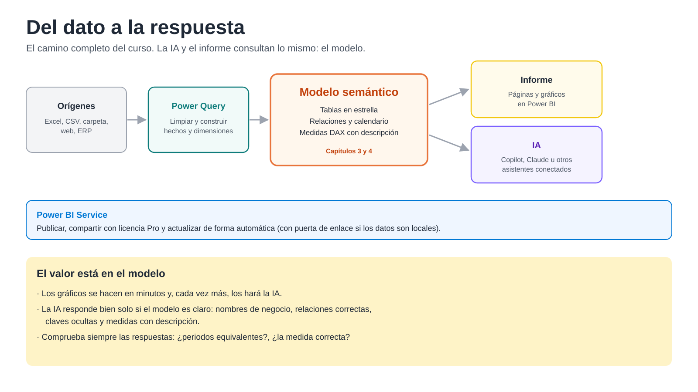

# 6. Publicar, compartir y el papel de la IA

**En este capítulo:** cómo se publica un informe en Power BI Service, qué hace falta para compartirlo y mantenerlo actualizado, y cómo la inteligencia artificial puede consultar el modelo que has construido.

---

## 6.1 Publicar y compartir

Hasta ahora todo ha ocurrido en Power BI Desktop, en tu ordenador. Para que otras personas vean el informe, se publica en **Power BI Service** (app.powerbi.com), la parte en la nube que viste en el capítulo 1.

### Cómo se publica

1. En Power BI Desktop, **Inicio > Publicar**.
2. Inicia sesión con tu cuenta de trabajo y elige un **área de trabajo**: una carpeta compartida en la nube donde un equipo guarda sus informes y modelos.
3. Power BI sube dos cosas por separado: el **modelo semántico** (las tablas, las relaciones y las medidas) y el **informe** (las páginas y los objetos visuales).

Que se publiquen por separado no es un detalle técnico: en Service se pueden crear otros informes nuevos sobre el mismo modelo, y la IA trabaja sobre el modelo, no sobre el informe.

### Qué licencia hace falta

| Quiero... | Licencia |
|---|---|
| Crear informes en Power BI Desktop | Ninguna: Desktop es gratuito |
| Publicar en mi área de trabajo personal | Cuenta gratuita de Power BI |
| Compartir informes con otras personas | **Pro** (quien publica y quien consulta), o una capacidad Premium o Fabric en la empresa |

### Cómo se mantiene actualizado

En Service se puede programar una **actualización automática**: cada mañana, por ejemplo, Power BI vuelve a leer los orígenes y recalcula el modelo. Pero Service está en la nube y no ve los archivos de tu ordenador. Para leer orígenes locales (un Excel en `C:\`, una base de datos de la oficina) hace falta instalar una **puerta de enlace** (*gateway*), un pequeño programa que hace de puente entre tus datos y la nube. Si los archivos están en SharePoint o OneDrive, no hace falta.

En clase lo verás como demostración.

---

## 6.2 La IA consulta el modelo

Al principio del curso dijimos que cada vez más la inteligencia artificial consultará directamente el modelo y generará informes al vuelo. Ya está ocurriendo, por dos caminos:

- **Copilot en Power BI.** El asistente de Microsoft integrado en Power BI. Responde preguntas en lenguaje natural sobre el modelo, propone páginas de informe y resume lo que muestran. Necesita una capacidad de Fabric de pago en la empresa, así que no siempre está disponible.
- **Asistentes de IA conectados al modelo.** Asistentes como Claude pueden conectarse a un modelo de Power BI a través de conectores (servidores MCP), tanto en Power BI Desktop como en Fabric. El asistente lee las tablas, las relaciones, las medidas y sus descripciones, escribe las consultas DAX necesarias y puede devolverte la respuesta, una tabla o un gráfico hecho al momento.

En clase verás una demostración: una pregunta escrita en lenguaje normal («¿qué familias han crecido más en 2025 frente a 2024, comparando de enero a septiembre?») y cómo el asistente la responde consultando el modelo que has construido en este curso.

### Por qué todo lo anterior importa más que nunca

La IA no adivina. Trabaja con lo que encuentra en el modelo, y por eso responde mejor cuando:

| Lo que hiciste en el curso | Por qué ayuda a la IA |
|---|---|
| Separar hechos y dimensiones (cap. 2 y 3) | Entiende qué se mide y por qué se puede filtrar |
| Relaciones de uno a varios bien hechas (cap. 3) | Los filtros llegan donde tienen que llegar |
| Nombres de negocio: `Cliente`, no `nomCom` (cap. 2 y 3) | Entiende tu pregunta con tus palabras |
| Ocultar claves y columnas de importe (cap. 3) | Usa las medidas correctas, no columnas sueltas |
| Medidas con nombre claro y descripción (cap. 4) | Sabe qué calcula cada una sin tener que suponer |
| Fila «Sin ruta» en lugar de «(En blanco)» (cap. 3) | No tiene que interpretar huecos |

Un modelo desordenado da respuestas desordenadas, aunque la IA sea muy buena. **El valor está en el modelo.**

> **Revisa siempre lo que responde la IA.** Es rápida, pero puede equivocarse, sobre todo con preguntas ambiguas. Con lo que has aprendido sabrás comprobarlo: ¿compara periodos equivalentes?, ¿usa la medida correcta?, ¿cuadra con la matriz?

---

## 6.3 Cierre

Has recorrido el camino completo:

1. **Orígenes:** conectaste con Excel, CSV, carpetas y la web.
2. **Power Query:** limpiaste y transformaste los datos hasta convertirlos en tablas de hechos y dimensiones.
3. **Modelo:** relacionaste las tablas en estrella, añadiste un calendario y una segunda tabla de hechos.
4. **DAX:** creaste medidas que responden a casi cualquier pregunta de negocio.
5. **Informe:** construiste una página de inicio y una de detalle.
6. **Publicar e IA:** viste cómo se comparte el resultado y cómo la IA lo aprovecha.

Si tuvieras que quedarte con una sola idea del curso: **dedica el tiempo a los datos y al modelo.** Los gráficos se hacen en minutos, y cada vez más los hará la IA por ti. Un buen modelo no lo hace nadie más que tú.
